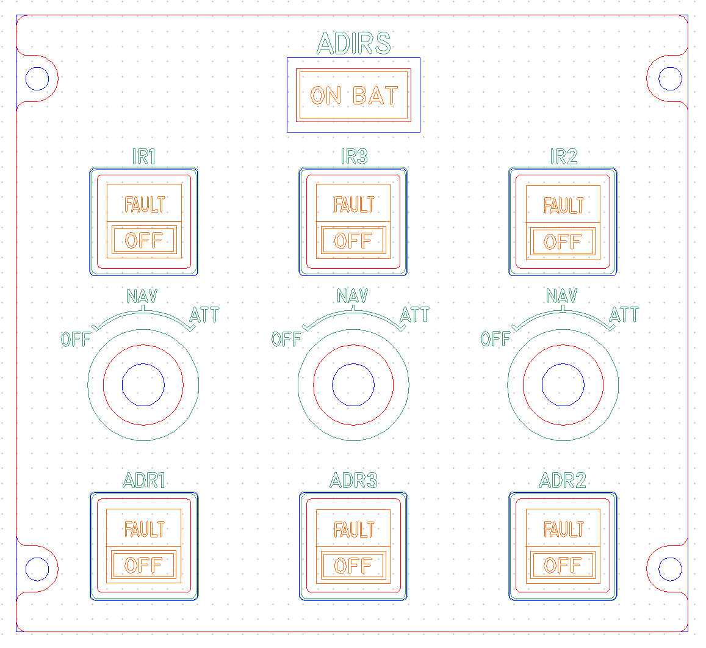
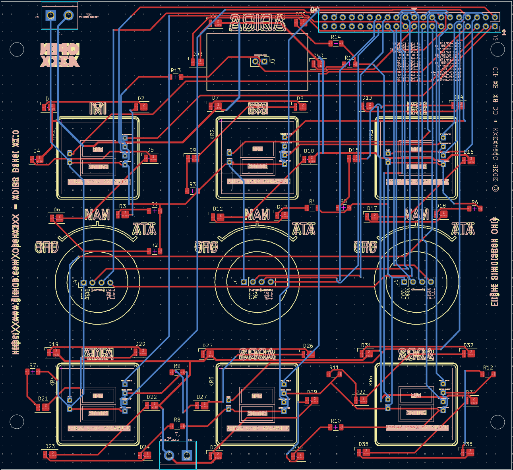
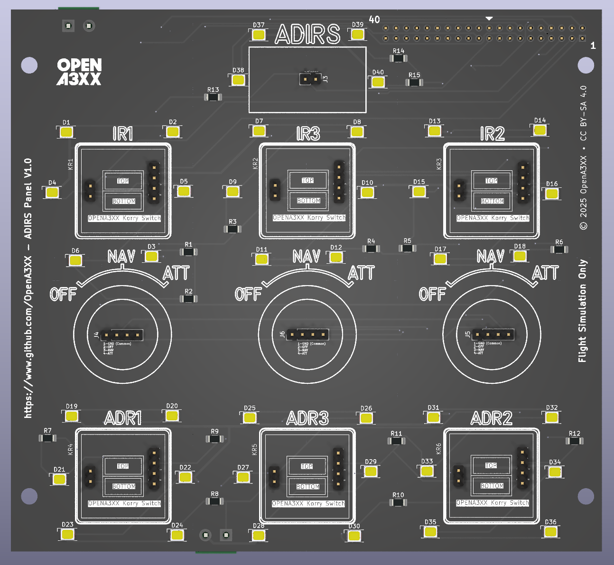
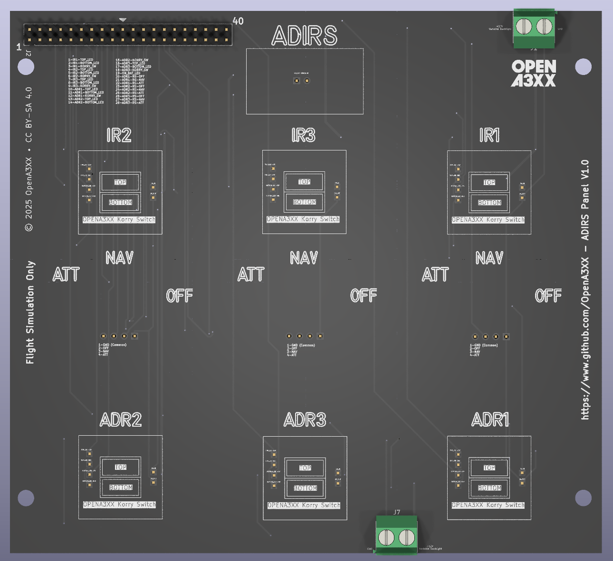

# OpenA3XX – ADIRS Panel v1.0  
**Flight Simulation Hardware – ADIRS Control Panel**

---

## Overview

This ADIRS panel replicates the **Air Data and Inertial Reference System (ADIRS)** panel found in Airbus aircraft. It includes 3 sets of IR (Inertial Reference) controls, 3 sets of ADR (Air Data Reference) controls, and a central **ON BAT** indicator.

The hardware design includes a **PCB assembly**, **front acrylic panel**, and provisions for illumination and interaction using tactile Korry-style switches and rotary selectors.

> ⚠️ **Flight Simulation Only – Not for use in real aviation applications.**

---

## Panel Layout

The ADIRS Panel is structured in a 3x2 grid format:

### Top Row – IR Controls:
- **IR1**, **IR3**, **IR2** (Left to Right)
  - Each IR module has:
    - A rectangular area for a Korry-style dual switch labeled `FAULT` and `OFF`.
    - A rotary selector with 3 positions: `OFF`, `NAV`, and `ATT`.
    - Clearly labeled silkscreen for selector positions and function.

### Middle:
- **ON BAT** indicator located centrally above the IR3 module.
- Legend "ADIRS" above the indicator.
- Marked component silkscreen for switch and LED placement.

### Bottom Row – ADR Controls:
- **ADR1**, **ADR3**, **ADR2** (Left to Right)
  - Each ADR module has:
    - Dual Korry-style switch positions (`FAULT`, `OFF`).
    - Component footprints for headers and illumination around switch area.

---

## PCB Details

### Connectors & Interfaces

#### J1 – 40-pin Header
- Main interface header.
- Clearly labeled silk for each pin (D0–D39, VCC, GND, etc.).
- Positioned at the top-right of the board for easy ribbon cable access.

#### J5, J6, J8 – 5-Pin Rotary Selector Headers
- Three identical headers for reading the IR selector positions.
- Labeled `IR1`, `IR2`, and `IR3` respectively.
- Mounted centrally under each rotary selector.

#### K1–K6 – Korry Switch Connectors
- 4-pin headers for each of the six switches (IR1–IR3 and ADR1–ADR3).
- Labeled and oriented to fit OpenA3XX Korry Switch modules.

#### J7 – 2-Pin Terminal Block
- Power input terminal at the bottom center of the board.

---

### LEDs and Indicators

- 39 yellow SMD LEDs (D1–D39) distributed across:
  - Switch perimeters for backlighting.
  - Selector positions (`OFF`, `NAV`, `ATT`).
  - ON BAT indicator.
- Each LED is paired with a current-limiting resistor (R1–R15) on the front-facing PCB.

---

### Mounting and Assembly

- 4 mounting holes in each corner for panel attachment.
- Screw holes on acrylic and PCB match for sandwich assembly.
- Panel artwork includes alignment marks for:
  - Rotary switch centers.
  - Switch outlines.
  - Legend markings.

---

## Fabrication and Panel Fit

### Acrylic Faceplate:
- Laser-etched legends for:
  - `IR1`, `IR2`, `IR3`
  - `ADR1`, `ADR2`, `ADR3`
  - `OFF`, `NAV`, `ATT`
  - `FAULT`, `OFF` (for Korry)
  - `ON BAT`, `ADIRS`
- CNC-milled cutouts:
  - For 6 Korry-style switches.
  - For 3 rotary selector encoders.
  - For ON BAT indicator.
- Color-coded preview:
  - Red = Front Panel.
  - Blue = Back Panel.  
  - Green = Engraving.
  - Orange = Korry Acrylic Labels.

---

## PCB Design Reference

The routing view (KiCad-style):
- Red = Top Layer (signal traces)  
- Blue = Bottom Layer  
- Yellow = Silkscreen and component boundaries  
- All vias and tracks are clearly defined for through-hole and surface-mount components.

---

## 🔗 Attribution

- **Version**: ADIRS Panel v1.0  
- **Project**: [OpenA3XX](https://www.github.com/OpenA3XX)  
- **License**: CC BY-SA 4.0  
- **Note**: Design for simulation use only.
