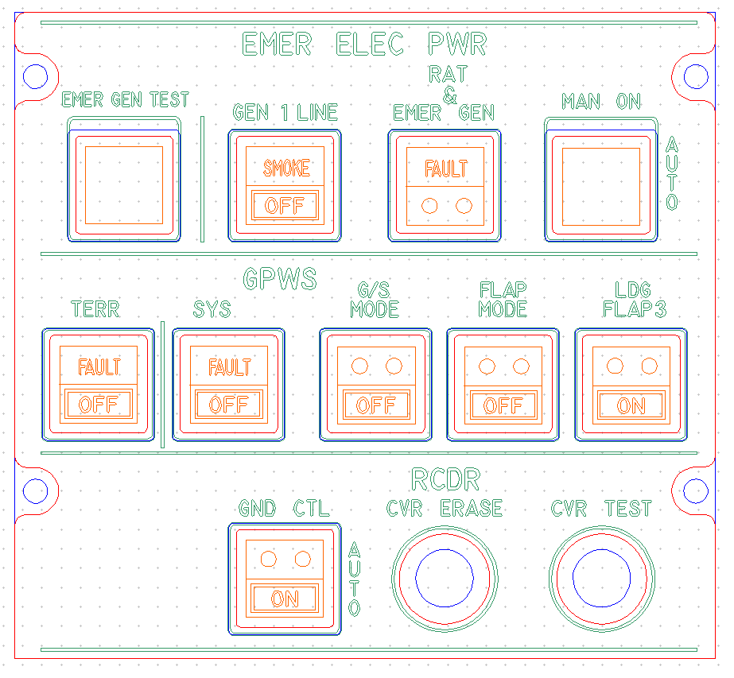
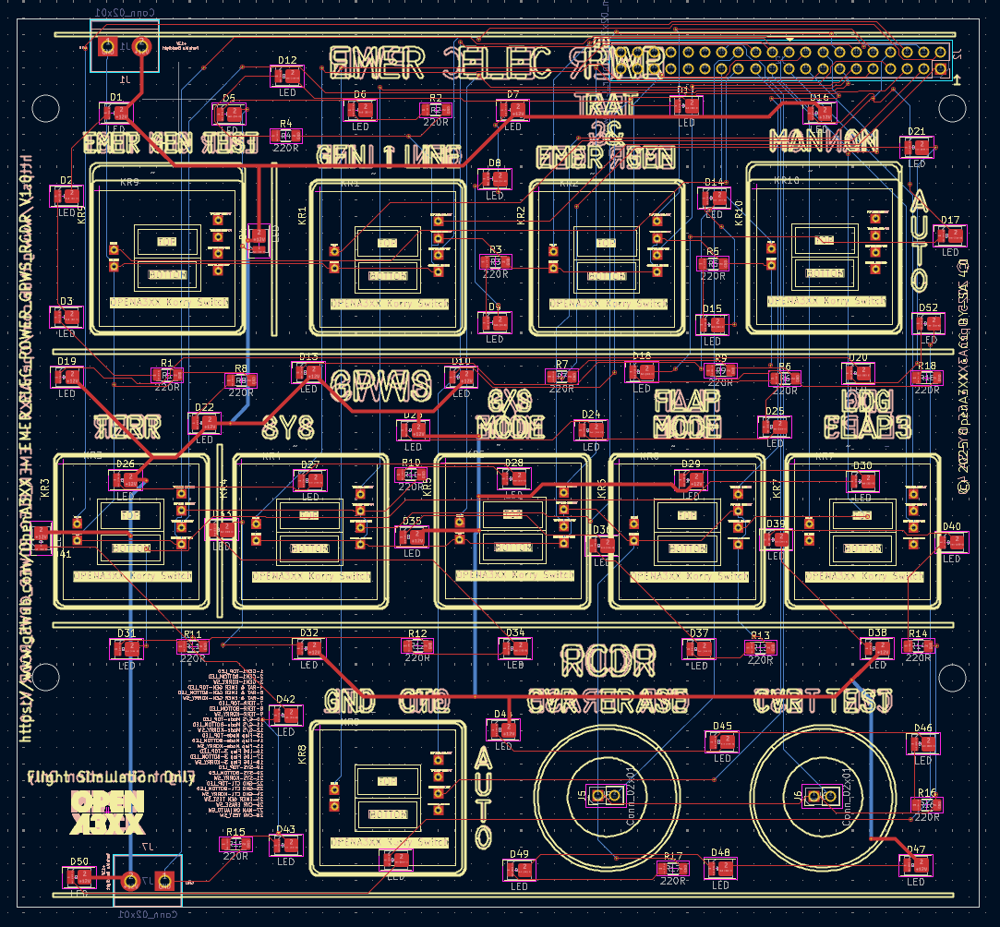
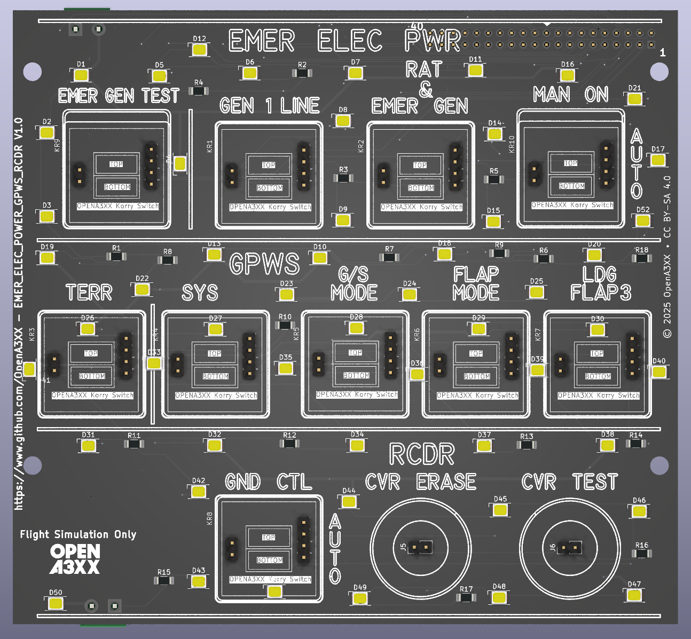
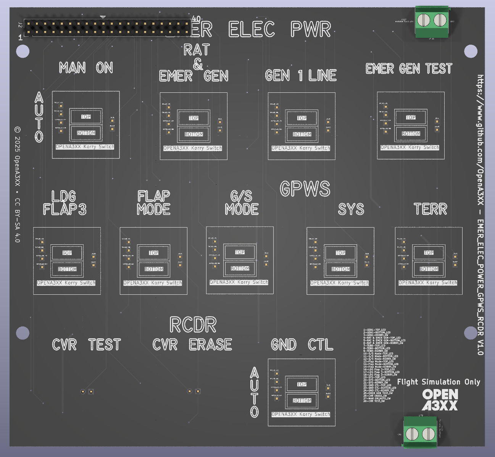

# OpenA3XX – EMER ELEC PWR / GPWS / RCDR Panel v1.0

**Flight Simulation Hardware – EMER ELEC PWR Control Panel**

---

## Overview

This panel replicates the **EMER ELEC PWR**, **GPWS**, and **RCDR** sections of the overhead panel found in Airbus aircraft. It includes a combination of push-button Korry-style switches for managing emergency electrical systems, ground proximity warnings, and cockpit voice recorder controls.

The hardware design includes a **PCB assembly**, **front acrylic panel**, and provisions for illumination and interaction using tactile Korry-style switches.

> ⚠️ **Flight Simulation Only – Not for use in real aviation applications.**

---

## Panel Layout

The panel is structured into 3 main zones:

### Top Row – EMER ELEC PWR:

- **EMER GEN TEST**: Test pushbutton with Korry-style label.
- **GEN 1 LINE**: Switch labeled `SMOKE / OFF`.
- **RAT & EMER GEN**: Labeled `FAULT` with indicator marks.
- **MAN ON / AUTO**: Korry Switch with AUTO and MAN positions.

### Middle Row – GPWS:

- **TERR** and **SYS**: Korry switches with `FAULT / OFF` labels.
- **G/S MODE**, **FLAP MODE**, **LDG FLAP3**: Korry-style switches with `OFF` and `ON` configurations.

### Bottom Row – RCDR:

- **GND CTL**: Switch with `ON / AUTO` legend.
- **CVR ERASE** and **CVR TEST**: Pushbutton with circular layout indicators.

---

## PCB Details

### Connectors & Interfaces

#### J1 – 40-pin Header

- Positioned at the top-left of the board for integration with harness or ribbon interface.

##### Connections

| Pin | Signal                    |
| --- | ------------------------- |
| 1   | GEN1-TOP_LED              |
| 2   | GEN1-BOTTOM_LED           |
| 3   | GEN1-KORRY_SW             |
| 4   | RAT & EMER GEN-TOP_LED    |
| 5   | RAT & EMER GEN-BOTTOM_LED |
| 6   | RAT & EMER GEN-KORRY_SW   |
| 7   | TERR-TOP_LED              |
| 8   | TERR-BOTTOM_LED           |
| 9   | TERR-KORRY_SW             |
| 10  | G/S Mode-TOP_LED          |
| 11  | G/S Mode-BOTTOM_LED       |
| 12  | G/S Mode-KORRY_SW         |
| 13  | Flap Mode-TOP_LED         |
| 14  | Flap Mode-BOTTOM_LED      |
| 15  | Flap Mode-KORRY_SW        |
| 16  | LDG Flap 3-TOP_LED        |
| 17  | LDG Flap 3-BOTTOM_LED     |
| 18  | LDG Flap 3-KORRY_SW       |
| 19  | SYS-TOP_LED               |
| 20  | SYS-BOTTOM_LED            |
| 21  | SYS-KORRY_SW              |
| 22  | GND CTL-TOP_LED           |
| 23  | GND CTL-BOTTOM_LED        |
| 24  | GND CTL-KORRY_SW          |
| 25  | EMER GEN TEST_KORRY_SW    |
| 26  | CVR ERASE_SW              |
| 27  | MAN ON\|AUTO_KORRY_SW     |
| 28  | CVR TEST_SW               |

#### K1–K10 – Korry Switch Connectors

- Each switch has 4-pin headers for signal and illumination control.
- Labeled directly on silkscreen for ease of assembly.

#### J2, J3, J4 – Test Switches and External Trigger Input

- 2-pin headers for discrete logic input of test switches (CVR, EMER GEN, etc.).

#### J5 – 2-Pin Terminal Block

- Located bottom center for 12V power and GND input.
- Drives all LED backlighting and switch lighting.

---

### LEDs and Indicators

- Over 45 yellow SMD LEDs (D1–D52) distributed around the switches and selectors for illumination.
- Paired with 220-ohm resistors (R1–R18) for current limiting.
- Centralized switch regions and legends lit via edge LED positioning.

---

### Mounting and Assembly

- 4x corner mounting holes aligned with front acrylic plate.
- Panel is designed for sandwich-style installation with easy removal for maintenance.
- Alignment marks etched for accurate placement of:
    - Korry modules.

---

## Fabrication and Panel Fit

### Acrylic Faceplate:

- Laser-etched legends include:
    - `EMER ELEC PWR`, `GPWS`, `RCDR`
    - `FAULT`, `OFF`, `ON`, `AUTO`, `SMOKE`, `ERASE`, etc.
- Cutouts accommodate:
    - 10 Korry-style rectangular switches.
    - 2 circular pushbuttons (CVR ERASE, CVR TEST).
    - 1 Korry Switch (MAN ON / AUTO).
- Color-coded preview:
    - Red = Panel Outline
    - Blue = Backside features
    - Green = Engraving / Legends
    - Orange = Text Engraving and Label Art

---

## PCB Design Reference

- Red = Top copper layer (signal routing)
- Blue = Bottom copper layer (returns and secondary routing)
- Yellow = Silkscreen (component IDs and labels)
- Vias, SMD pads, and through-holes are clearly annotated.

---

## 🔗 Attribution

- **Version**: EMER ELEC PWR / GPWS / RCDR Panel v1.0
- **Project**: [OpenA3XX](https://www.github.com/OpenA3XX)
- **License**: CC BY-SA 4.0
- **Note**: Design for simulation use only.
