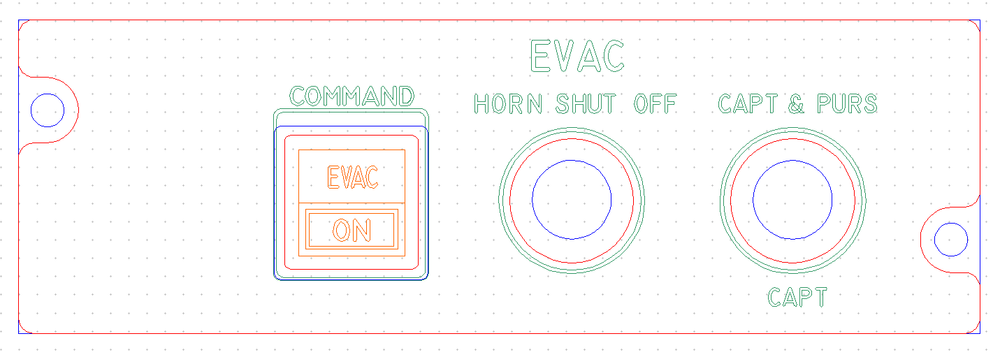
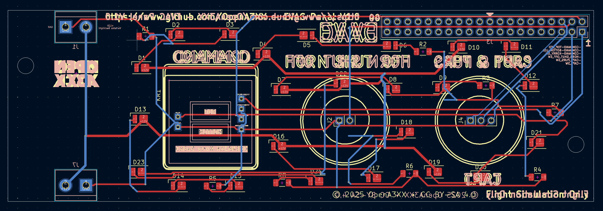
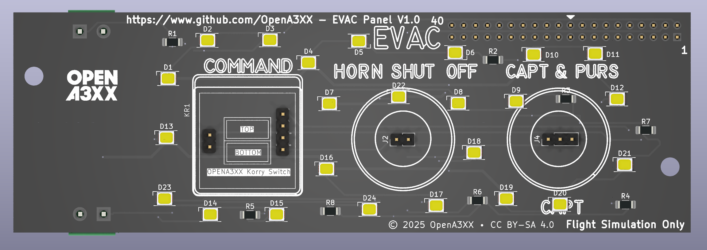
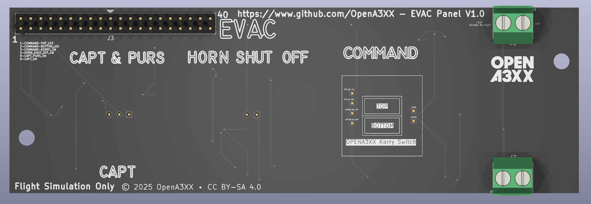

# OpenA3XX – EVAC Panel v1.0  
**Flight Simulation Hardware – Evacuation Command Panel**

---

## Overview

This panel replicates the **EVAC (Evacuation)** section found in the overhead panel of Airbus A3XX aircraft. It provides simulated support for:

- Activating an evacuation alarm through a dual Korry-style switch.
- Silencing the horn with a selector.
- Choosing between crew activation modes: Captain or Captain & Purser.

> ⚠️ **Flight Simulation Only – Not for use in real aviation applications.**

---

## Panel Layout

This panel uses a horizontal layout featuring one Korry switch and two rotary selector positions:

- From left to right:
  - **COMMAND**: Dual Korry-style switch (`EVAC` / `ON`)
  - **HORN SHUT OFF**: Push To Make Switch
  - **CAPT & PURS / CAPT**: Up/Down Selector Switch

The front panel acrylic features a centered **EVAC** title and clearly engraved labels above each interaction point.

---

## PCB Details

### Connectors & Interfaces

#### J3 – 40-Pin Header (Top Edge)
- Provides dedicated pins for LEDs and switch outputs:

| Pin | Signal               |
|-----|----------------------|
| 1   | COMMAND-TOP_LED      |
| 2   | COMMAND-BOTTOM_LED   |
| 3   | COMMAND-KORRY_SW     |
| 4   | HORN_SHUT_OFF_SW     |
| 5   | CAPT_PURS_SW         |
| 6   | CAPT_SW              |

#### J1 – 2-Pin Terminal Block (Top Right)
- Supplies power for the LED backlighting.
- Marked: `+12V Variable Backlight` and `GND`

#### Internal Headers:
- **J2** – For HORN SHUT OFF rotary selector
- **J4** – For CAPT & PURS rotary selector

Each selector has its own silkscreen footprint and clearly labeled pads.

---

### LEDs and Indicators

- 24 yellow surface-mounted LEDs (D1–D24) placed around:
  - The EVAC switch
  - HORN SHUT OFF selector
  - CAPT & PURS selector
- Ensures consistent illumination across the panel.
- Resistors R1–R8 regulate current per LED group.

---

### Mounting and Assembly

- 2 corner mounting holes on each side of the PCB and acrylic front plate.
- Routed cutouts for:
  - Korry switch (COMMAND)
  - Rotary selectors (HORN SHUT OFF, CAPT & PURS)
- Clear silkscreen outlines and component labels aid in alignment.

---

## Fabrication and Panel Fit

### Acrylic Front Panel:
- CNC-milled with legends for:
  - `EVAC`, `COMMAND`, `HORN SHUT OFF`, `CAPT & PURS`, `CAPT`
  - Switch labels: `EVAC` (top), `ON` (bottom)
- Color-coded DXF-style layout:
  - Red = Front Panel  
  - Blue = Back Panel  
  - Green = Engraving  
  - Orange = Korry Labels

Panel alignment is ensured with component placement and LED zones matching the front panel cutouts.

---

## PCB Design Reference

  
  

- Red = top copper layer  
- Blue = bottom copper layer  
- Yellow = silkscreen and outlines  
- White = connector legends

Routing is clean and optimized for LED distribution and switch wiring consistency.

---

## Attribution

- **Version**: EVAC Panel v1.0  
- **Project**: [OpenA3XX](https://www.github.com/OpenA3XX)  
- **License**: CC BY-SA 4.0  
- **Note**: Design for simulation use only.
