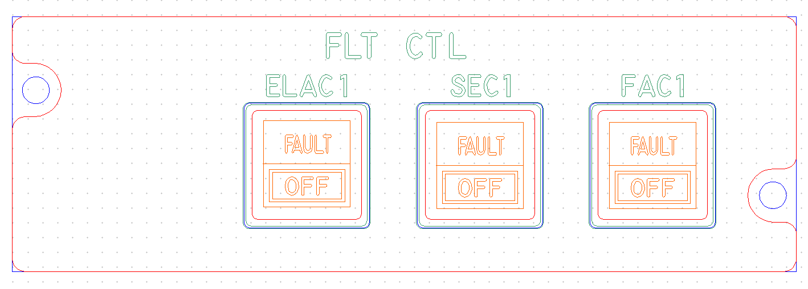
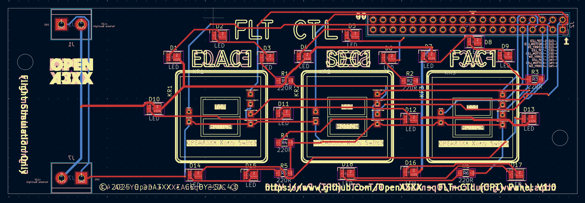
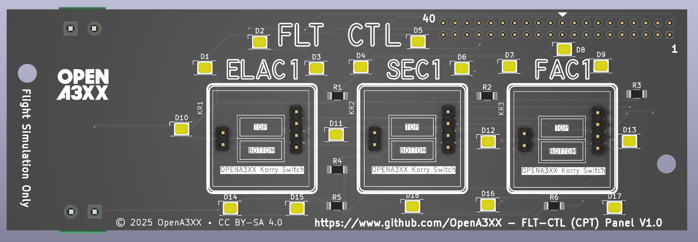
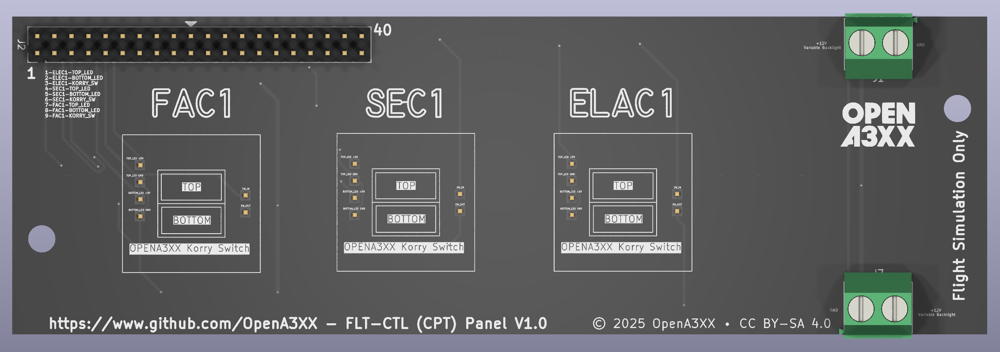

# OpenA3XX – FLT CTL Panel (CPT) v1.0

**Flight Simulation Hardware – Flight Control Panel (Captain Side)**

---

## Overview

This panel replicates the **Flight Control (FLT CTL)** section of the Airbus A3XX cockpit, specifically for the captain's side. It enables simulation of control toggling for three key flight control computers:

- **ELAC1** (Elevator Aileron Computer)
- **SEC1** (Spoiler Elevator Computer)
- **FAC1** (Flight Augmentation Computer)

Each module is presented with a backlit Korry-style dual switch (`FAULT`, `OFF`) and matching legend.

> ⚠️ **Flight Simulation Only – Not for use in real aviation applications.**

---

## Panel Layout

This panel uses a horizontal alignment of the three control modules:

| Switch    | Function                         | Legend                      | Type            |
| --------- | -------------------------------- | --------------------------- | --------------- |
| **ELAC1** | Elevator Aileron Computer switch | `FAULT` Amber / `OFF` White | Momentary Korry |
| **SEC1**  | Spoiler Elevator Computer switch | `FAULT` Amber / `OFF` White | Momentary Korry |
| **FAC1**  | Flight Augmentation Computer     | `FAULT` Amber / `OFF` White | Momentary Korry |

The front panel acrylic features laser-engraved legends for each function and a centered “FLT CTL” label above the modules.

---

## PCB Details

### Connectors & Interfaces

#### J1 – 40-Pin Header (Top Left)

- Provides individual outputs for:
    - Top LED
    - Bottom LED
    - Switch state (momentary)

#### J7 – 2-Pin Terminal Block (Bottom Center)

- Marked `+12V Variable Backlight` and `GND`
- Supplies power to the LED backlight system.

#### Korry Switch Pads

- Labeled for:
    - `TOP_LED +5V`, `TOP_LED GND`
    - `BOTTOM_LED +5V`, `BOTTOM_LED GND`
    - `SW_GND`, `SW_OUT`

Each Korry switch has its own silkscreen footprint and dedicated labeled pad for clear wiring.

| Pin | Signal           |
| --- | ---------------- |
| 1   | ELEC1-TOP_LED    |
| 2   | ELEC1-BOTTOM_LED |
| 3   | ELEC1-KORRY_SW   |
| 4   | SEC1-TOP_LED     |
| 5   | SEC1-BOTTOM_LED  |
| 6   | SEC1-KORRY_SW    |
| 7   | FAC1-TOP_LED     |
| 8   | FAC1-BOTTOM_LED  |
| 9   | FAC1-KORRY_SW    |

---

### LEDs and Indicators

- Yellow surface-mounted LEDs (D1–D18) positioned around the three switch zones.
    - Each module has 6 LEDs to ensure uniform backlighting.
- Current-limiting resistors (R1–R6) are positioned near the LED arrays and matched per module.

---

### Mounting and Assembly

- 2 large corner mounting holes on both sides of the PCB and acrylic panel.
- The silkscreen includes:
    - Accurate outlines for Korry switch modules.
    - Pin labels and alignment guides.
- Switches fit into center-aligned footprints with routed panel cutouts.

---

## Fabrication and Panel Fit

### Acrylic Front Panel:

- CNC-cut with legends for:
    - `FLT CTL`, `ELAC1`, `SEC1`, `FAC1`
    - Korry button text: `FAULT` (top), `OFF` (bottom)
- Color-coded DXF-like layout:
    - Red = Front Panel
    - Blue = Back Panel
    - Green = Engraving
    - Orange = Korry Labels

Acrylic cutouts align precisely with the PCB-mounted components and LEDs for consistent backlighting and tactile switch feedback.

---

## PCB Design Reference

- Red traces = top copper layer
- Blue traces = bottom copper layer
- Yellow = component silkscreen and labels
- White silkscreen shows connector references and legends

The board is designed for a clean signal path and simplified wiring between the 40-pin header and the three switches.

---

## Attribution

- **Version**: FLT CTL (CPT) Panel v1.0
- **Project**: [OpenA3XX](https://www.github.com/OpenA3XX)
- **License**: CC BY-SA 4.0
- **Note**: Design for simulation use only.
