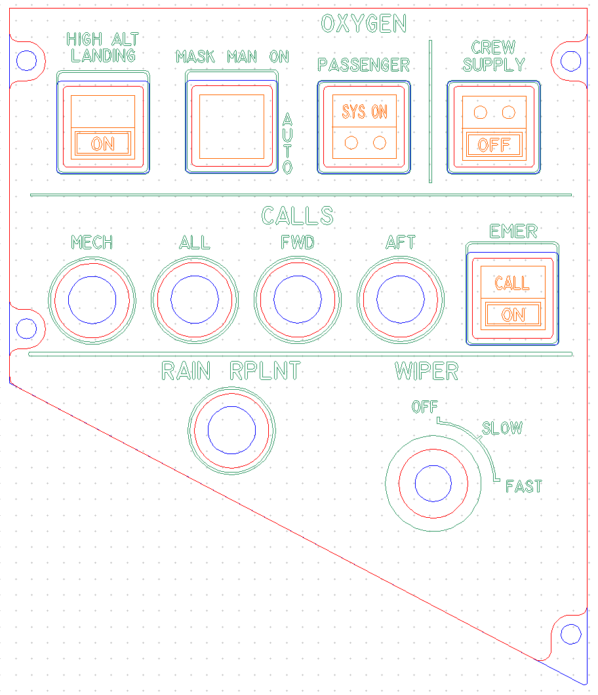
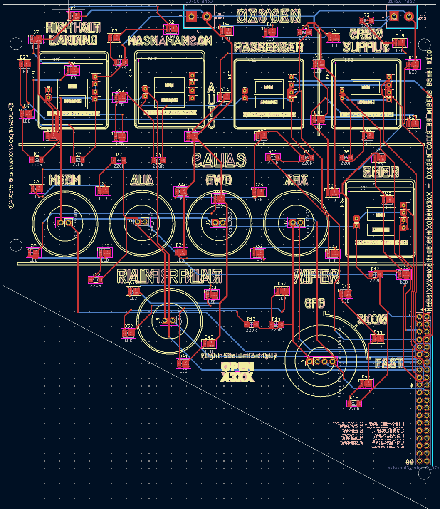
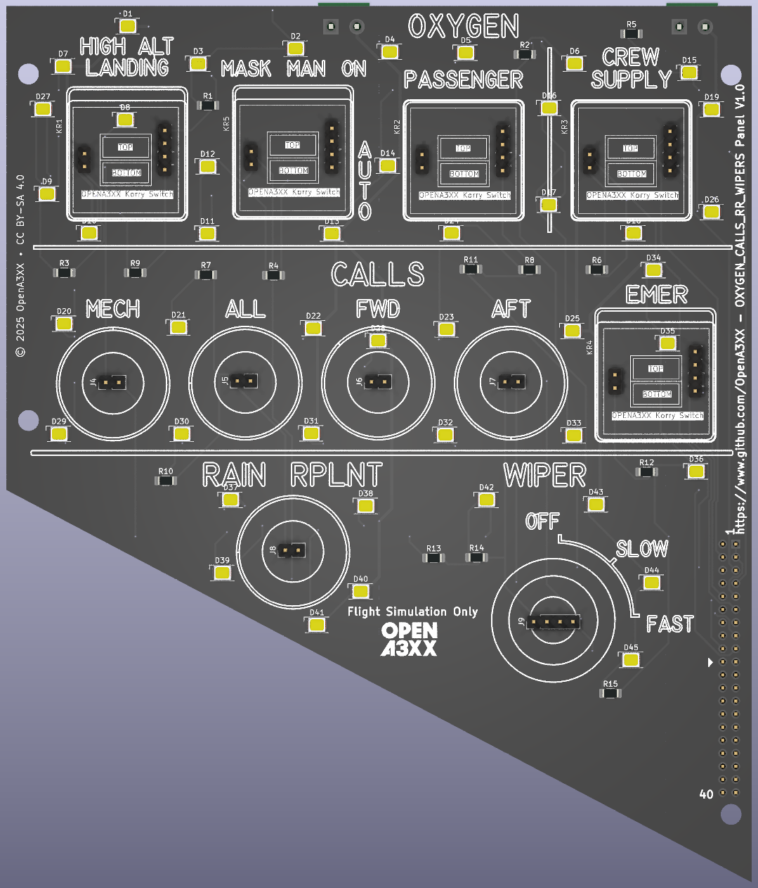
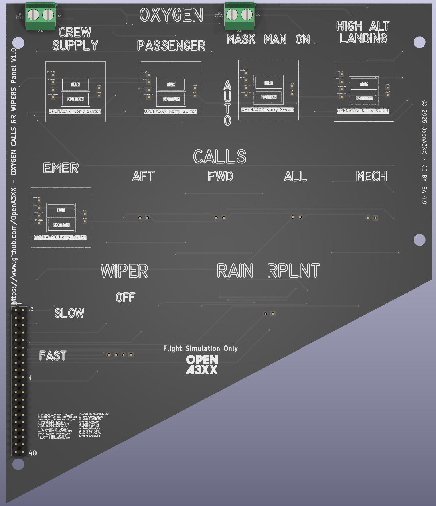

# OpenA3XX – OCRW Panel v1.0  
**Flight Simulation Hardware – Oxygen, Calls, Rain Repellent, and Wipers Control Panel**

---

## Overview

This OCRW panel replicates a section of the **overhead panel** in Airbus aircraft, providing controls for **oxygen systems**, **intercom/call signaling**, **rain repellent**, and **windshield wipers**.

The hardware is composed of a **PCB assembly**, **laser-etched front panel**, and integrated tactile control components including **Korry-style pushbutton switches** and a **rotary selector**.

> ⚠️ **Flight Simulation Only – Not for use in real aviation applications.**

---

## Panel Layout

The OCRW panel layout is logically split into functional zones:

### Top Row – Oxygen Controls
- **HIGH ALT LANDING**
- **MASK MAN ON**
- **PASSENGER SYS ON**
- **CREW SUPPLY OFF**

Each control features:
- A rectangular Korry-style illuminated switch (with ON/OFF legends).
- Vertical "AUTO" label next to "MASK MAN ON".
- Grouped under the **OXYGEN** header with visible dividing line.

### Middle Row – Call Buttons
Labeled under **CALLS**, these are pushbuttons for intercom signaling:
- **MECH**
- **ALL**
- **FWD**
- **AFT**
- **EMER CALL ON** (uses Korry-style illuminated switch)

Each position is marked for a circular switch or illuminated pushbutton.

### Bottom Row – Rain and Wiper Systems
- **RAIN RPLNT**: Pushbutton location  
- **WIPER Rotary Switch**:  
  - 3 positions: `OFF`, `SLOW`, `FAST`  
  - Curved arc label with selector indentation

---

## PCB Details

  
  

### Connectors & Interfaces

#### J1 – 40-pin Header (Main Connector)
Located at the lower-right corner of the PCB. Handles all signals including LEDs, buttons, and switches.

##### Pin Assignments

| Pin | Signal                      |
|-----|-----------------------------|
| 1   | HIGH_ALT_LANDING-TOP_LED    |
| 2   | HIGH_ALT_LANDING-BOTTOM_LED |
| 3   | HIGH_ALT_LANDING-KORRY_SW   |
| 4   | PASSENGER-TOP_LED           |
| 5   | PASSENGER-BOTTOM_LED        |
| 6   | PASSENGER-KORRY_SW          |
| 7   | CREW_SUPPLY-TOP_LED         |
| 8   | CREW_SUPPLY-BOTTOM_LED      |
| 9   | CREW_SUPPLY-KORRY_SW        |
| 10  | CALL_EMER-TOP_LED           |
| 11  | CALL_EMER-BOTTOM_LED        |
| 12  | CALL_EMER-KORRY_SW          |
| 13  | MASK_MAN_ON_SW              |
| 14  | CALLS_MECH_SW               |
| 15  | CALLS_ALL_SW                |
| 16  | CALLS_FWD_SW                |
| 17  | CALLS_AFT_SW                |
| 18  | RAIN_RPLNT_SW               |
| 19  | WIPER_OFF_SW                |
| 20  | WIPER_SLOW_SW               |
| 21  | WIPER_FAST_SW               |

### LEDs and Indicators

- Yellow **SMD LEDs (D1–D45)** for:
  - Button illumination
  - Label backlighting (e.g., AUTO, SLOW/FAST arc)
  - System ON indications

- Each LED is paired with a **current-limiting resistor (R1–R15)**

---

### Mounting and Assembly

- **4 main mounting holes** for panel attachment (corners)
- **M3 screw spacing** compatible with front acrylic panel
- **Laser alignment holes** ensure correct positioning of:
  - Switches
  - Rotary encoders
  - Acrylic overlay

---

## Fabrication and Panel Fit

### Acrylic Faceplate

- **Engraved legends**:
  - All switch labels (e.g., HIGH ALT, MASK MAN ON, CALL ON)
  - Section titles: OXYGEN, CALLS, WIPER, RAIN RPLNT
  - Arc markings for the wiper rotary control

- **Cutouts**:
  - 6 rectangular Korry-style switches
  - 6 circular button holes
  - 1 rotary encoder (wiper switch)

- **Color Code (DXF Format)**:
  - **Red** = Front Cutouts  
  - **Blue** = Rear Cutouts  
  - **Green** = Engravings  
  - **Orange** = Korry Labels (SYS ON, CALL ON, etc.)

---

## PCB Design Reference

The routing view shows:
- **Red** = Top Layer Traces  
- **Blue** = Bottom Layer Traces  
- **Yellow** = Component boundaries and silkscreen  
- Mixed use of **through-hole and SMD** components:
  - Switch headers
  - LEDs
  - Resistors
  - Rotary encoder

---

## 🔗 Attribution

- **Version**: OCRW Panel v1.0  
- **Project**: [OpenA3XX](https://www.github.com/OpenA3XX)  
- **License**: CC BY-SA 4.0  
- **Note**: Design for simulation use only.
