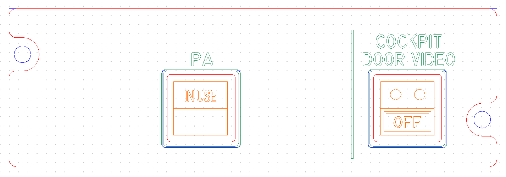
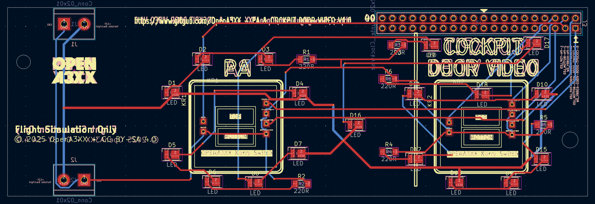
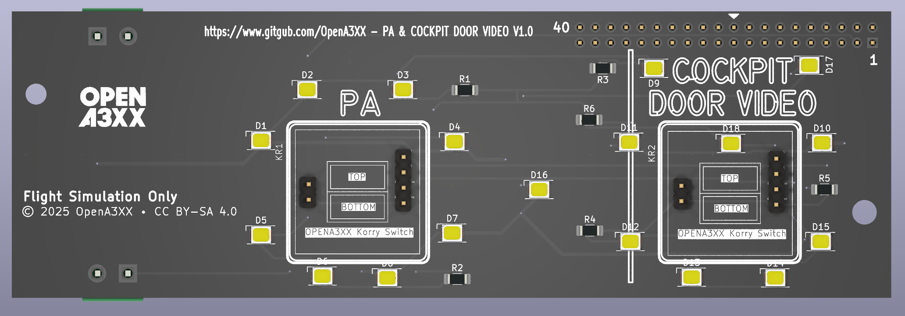
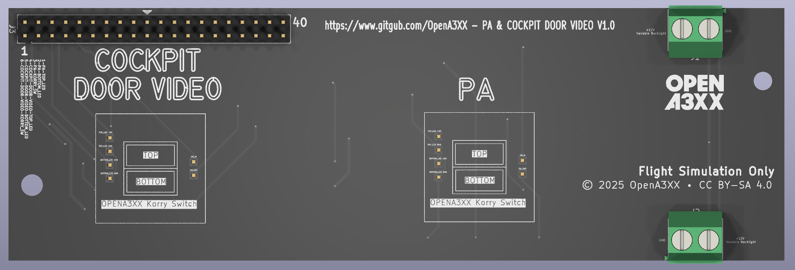

# OpenA3XX – PA & Cockpit Door Video Panel v1.0

**Flight Simulation Hardware – PA and Cockpit Video Controls**

---

## Overview

This compact panel replicates two functions from the Airbus overhead: the **Passenger Address (PA)** system and **Cockpit Door Video monitoring**.

It includes two **Korry-style illuminated pushbuttons**, mounted on a single PCB and paired with a laser-etched front panel. This design allows for backlit legends and simulation-compatible interaction.

> ⚠️ **Flight Simulation Only – Not for use in real aviation applications.**

---

## Panel Layout

This panel includes two modules:

### Left – PA Button

- Marked **PA** with a **Korry-style switch** labeled `IN USE`.
- Used for activating the passenger announcement system.

### Right – Cockpit Door Video

- Marked **COCKPIT DOOR VIDEO** with a **Korry-style switch** labeled `OFF`.
- Simulates the video system control for cockpit door monitoring.
- Separated by a vertical legend divider for clarity.

---

## PCB Details

  
  

### Connectors & Interfaces

#### J3 – 40-pin Header (Top Side)

- Main interface for I/O control via flat ribbon cable.
- Connects all switch states and LEDs to the controller.

##### Pin Mapping

| Pin | Signal                        |
| --- | ----------------------------- |
| 1   | PA-TOP_LED                    |
| 2   | PA-BOTTOM_LED                 |
| 3   | PA-KORRY_SW                   |
| 4   | COCKPIT-DOOR-VIDEO-TOP_LED    |
| 5   | COCKPIT-DOOR-VIDEO-BOTTOM_LED |
| 6   | COCKPIT-DOOR-VIDEO-KORRY_SW   |

#### J1 & J2 – Power Terminal Blocks

- Dual **2-pin screw terminals** on bottom edge.
- Marked `+12V` and `GND`.
- Supplies variable brightness LED backlighting.

---

### LEDs and Indicators

- **18 SMD LEDs (D1–D18)** used for:
    - Button face illumination (top & bottom halves)
    - Panel backlight around each Korry switch

- Each LED is current-limited by a nearby **resistor (R1–R6)**.

---

### Mounting and Assembly

- **4 mounting holes**, corner-located for secure panel integration.
- Matching holes between acrylic and PCB for easy alignment.
- Switches and LEDs positioned for drop-in Korry unit compatibility.

---

## Fabrication and Panel Fit

### Acrylic Faceplate

- **Engraved legends**:
    - `PA`, `IN USE`
    - `COCKPIT DOOR VIDEO`, `OFF`

- **Cutouts**:
    - 2 rectangular Korry switch windows

- **Color Coding in DXF File**:
    - **Red** = Front Face Panel Cuts
    - **Blue** = Back Panel Cuts
    - **Green** = Laser Engravings
    - **Orange** = Internal Korry Legends

---

## PCB Design Reference

The routing view shows:

- **Red** = Top Copper Traces
- **Blue** = Bottom Copper Traces
- **Yellow** = Silkscreen and component placements

The board integrates:

- Through-hole Korry switch headers
- SMD resistors and LEDs
- Two power input points
- One main I/O ribbon header

---

## 🔗 Attribution

- **Version**: PA & Cockpit Door Video Panel v1.0
- **Project**: [OpenA3XX](https://www.github.com/Open)
