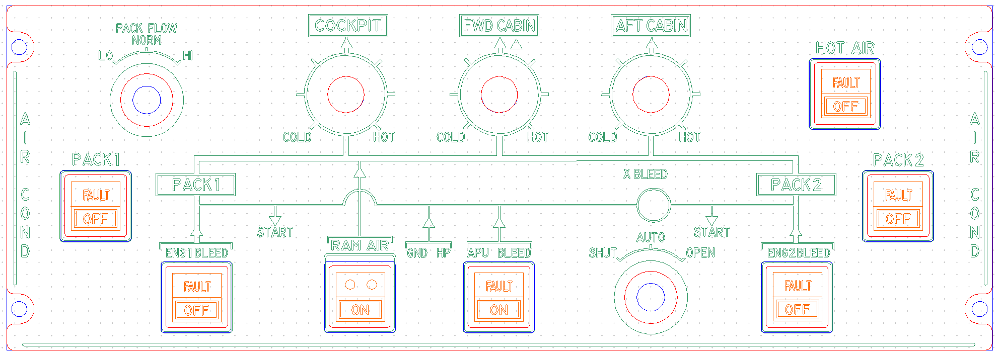
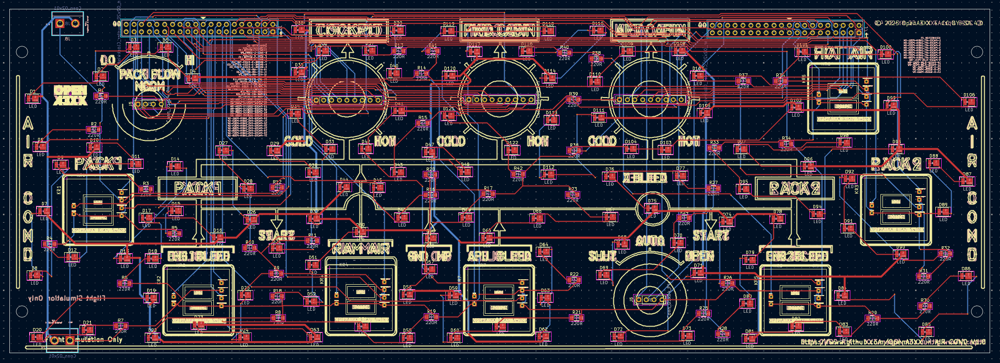
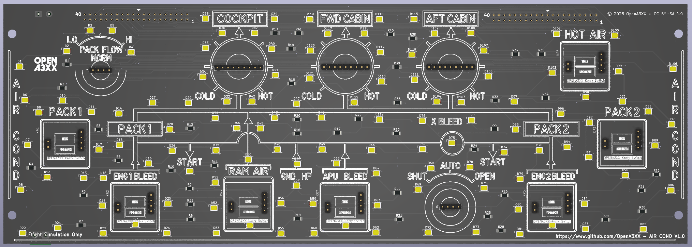
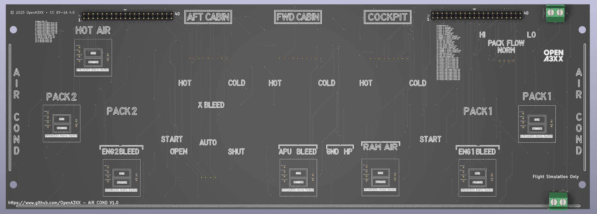

# OpenA3XX – AIR COND Panel v1.0  
**Flight Simulation Hardware – Air Conditioning Control Panel**

---

## Overview

This AIR COND panel replicates the **Air Conditioning and Pneumatic Control System** panel found in Airbus aircraft. It includes controls and indicators for managing cabin airflow, temperature regulation, bleed air sources, and emergency air intake.

The design includes a **PCB assembly**, a **laser-engraved acrylic faceplate**, and multiple **Korry-style switches** with dual LEDs for FAULT and OFF states. The panel also features rotary selectors for PACK FLOW, X BLEED, and individual temperature controls for the cockpit and cabin zones.

> ⚠️ **Flight Simulation Only – Not for use in real aviation applications.**

---

## Panel Layout

The panel is arranged in three distinct layers of interaction zones:

### Top Row – Rotary Selectors and Flow Control:
- **PACK FLOW Selector**
  - Positions: `LO`, `NORM`, `HI`
  - Adjusts airflow intensity.
- **COCKPIT**, **FWD CABIN**, **AFT CABIN**
  - Each zone features a rotary selector with positions ranging from `COLD` to `HOT` for temperature regulation.

### Middle Row – Functional Routing and System Map:
- Functional silkscreen mimics the aircraft’s pneumatic system routing:
  - **PACK1** and **PACK2** lines
  - **ENG1 BLEED**, **ENG2 BLEED**
  - **RAM AIR**, **APU BLEED**, **GND HP**
  - **X BLEED** rotary selector (`SHUT`, `AUTO`, `OPEN`)
- Annotated flow diagram includes airflow arrows and zone boundaries.

### Bottom Row – Korry Switches:
- **PACK1**, **PACK2**
  - FAULT/OFF switch indicators
- **ENG1 BLEED**, **ENG2 BLEED**
  - Dual Korry switches for each engine bleed source
- **HOT AIR**, **APU BLEED**
  - Control switches with FAULT/OFF or ON indicators
- **RAM AIR**
  - Emergency air intake, Korry switch with dual-light ON indicator

---

## PCB Details

  
  

---

### Connectors & Interfaces
#### CONNECTION J1

| Pin | Signal                      |
|-----|-----------------------------|
| 1   | PACK-1-TOP_LED              |
| 2   | PACK-1-BOTTOM_LED           |
| 3   | PACK-1-KORRY_SW             |
| 4   | PACK-2-TOP_LED              |
| 5   | PACK-2-BOTTOM_LED           |
| 6   | PACK-2-KORRY_SW             |
| 7   | ENGINE-2-BLEED-TOP_LED      |
| 8   | ENGINE-2-BLEED-BOTTOM_LED   |
| 9   | ENGINE-2-BLEED-KORRY_SW     |
| 10  | HOT-AIR-TOP_LED             |
| 11  | HOT-AIR-BOTTOM_LED          |
| 12  | HOT-AIR-KORRY_SW            |
| 13  | APU-BLEED-TOP_LED           |
| 14  | APU-BLEED-BOTTOM_LED        |
| 15  | APU-BLEED-KORRY_SW          |
| 16  | ENGINE-1-BLEED-TOP_LED      |
| 17  | ENGINE-1-BLEED-BOTTOM_LED   |
| 18  | ENGINE-1-BLEED-KORRY_SW     |
| 19  | RAM-AIR-TOP_LED             |
| 20  | RAM-AIR-BOTTOM_LED          |
| 21  | RAM-AIR-KORRY_SW            |
| 22  | PACKS-COCKPIT-POS1-SW       |
| 23  | PACKS-COCKPIT-POS2-SW       |
| 24  | PACKS-COCKPIT-POS3-SW       |
| 25  | PACKS-COCKPIT-POS4-SW       |
| 26  | PACKS-COCKPIT-POS5-SW       |
| 27  | PACKS-COCKPIT-POS6-SW       |
| 28  | PACKS-COCKPIT-POS7-SW       |
| 29  | PACKS-COCKPIT-POS8-SW       |
| 30  | PACKS-FWD_CABIN-POS1-SW     |
| 31  | PACKS-FWD_CABIN-POS2-SW     |
| 32  | PACKS-FWD_CABIN-POS3-SW     |
| 33  | PACKS-FWD_CABIN-POS4-SW     |
| 34  | PACKS-FWD_CABIN-POS5-SW     |
| 35  | PACKS-FWD_CABIN-POS6-SW     |
| 36  | PACKS-FWD_CABIN-POS7-SW     |
| 37  | PACKS-FWD_CABIN-POS8-SW     |

#### CONNECTION J7

| Pin | Signal                      |
|-----|-----------------------------|
| 1   | PACKS-AFT_CABIN-POS1-SW     |
| 2   | PACKS-AFT_CABIN-POS2-SW     |
| 3   | PACKS-AFT_CABIN-POS3-SW     |
| 4   | PACKS-AFT_CABIN-POS4-SW     |
| 5   | PACKS-AFT_CABIN-POS5-SW     |
| 6   | PACKS-AFT_CABIN-POS6-SW     |
| 7   | PACKS-AFT_CABIN-POS7-SW     |
| 8   | PACKS-AFT_CABIN-POS8-SW     |
| 9   | PACKS-FLOW-POS1-SW          |
| 10  | PACKS-FLOW-POS2-SW          |
| 11  | PACKS-FLOW-POS3-SW          |
| 12  | X-BLEED-POS1-SW             |
| 13  | X-BLEED-POS2-SW             |
| 14  | X-BLEED-POS3-               |

#### J1, J2 – 40-Pin Header Interfaces
- Positioned at the top-left and top-right of the PCB
- Clearly labeled silkscreen for signal routing (D0–D39, VCC, GND)
- Supports dual microcontroller or multiplexed control

#### K1–K8 – Korry Switch Modules
- Each switch location features:
  - Silkscreen outline
  - Dual 3-pin header footprints for LED and input integration
  - Positioned for OpenA3XX standard Korry switches

#### J3 – 2-Pin Terminal Block
- Power input terminal for common supply to LEDs and logic
- Located at the bottom center of the PCB

---

### LEDs and Indicators

- Over **100 SMD LEDs** placed around:
  - Korry switch frames
  - Rotary selector positions (rotary halo)
  - Silkscreen elements for visual guidance
- Labeled as D1–D106
- Controlled via 220-ohm resistors labeled R1–R46 for current limiting

---

### Mounting and Assembly

- **4 corner mounting holes** align the front and PCB layers
- All cutouts for rotary selectors and Korry switches are CNC-precise
- Silkscreen includes flow diagram, selector labels, and system paths
- Back panel supports flush mount to the main simulator frame

---

## Fabrication and Panel Fit

### Acrylic Faceplate:
- Laser-etched engravings for:
  - `AIR COND`, `PACK1`, `PACK2`, `HOT AIR`, `RAM AIR`
  - Temperature control zones (`COCKPIT`, `FWD CABIN`, `AFT CABIN`)
  - Flow selectors: `PACK FLOW`, `X BLEED`
  - Korry labels: `FAULT`, `OFF`, `ON`
- Color-coded preview:
  - Red = Front Panel cut  
  - Blue = Back Panel  
  - Green = Engraving  
  - Orange = Korry switch acrylic legends

---

## PCB Design Reference

Routing and layout (KiCad-style rendering):

- **Red**: Top signal layer  
- **Blue**: Bottom signal layer  
- **Yellow**: Silkscreen and outlines  
- Vias, pads, and traces are clearly routed for easy soldering and inspection

---

## 🔗 Attribution

- **Version**: AIR COND Panel v1.0  
- **Project**: [OpenA3XX](https://www.github.com/OpenA3XX)  
- **License**: CC BY-SA 4.0  
- **Note**: Design for flight simulation and educational use only.
