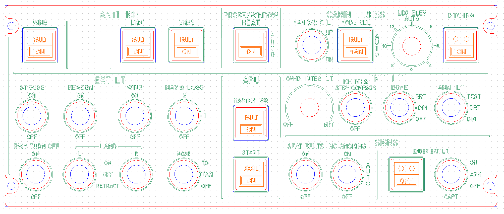
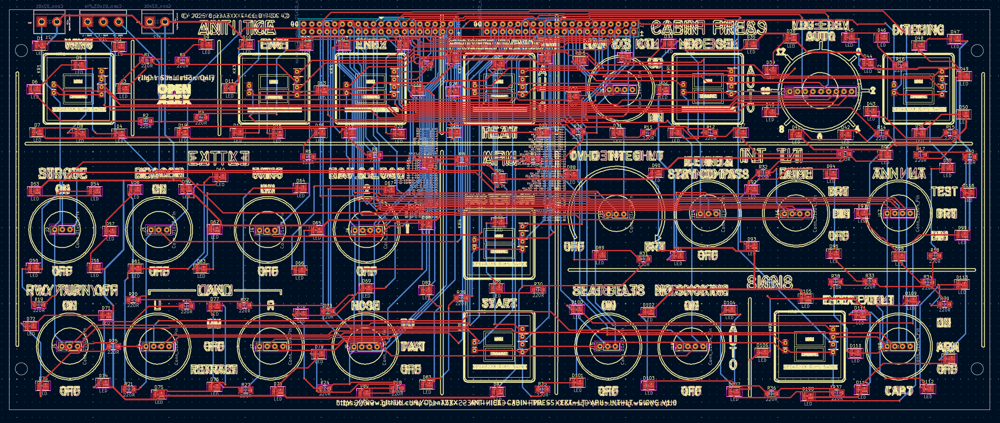
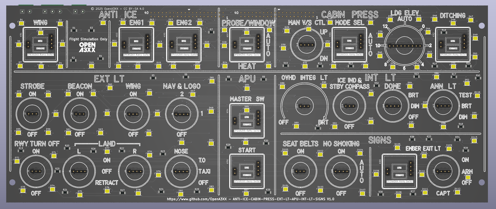
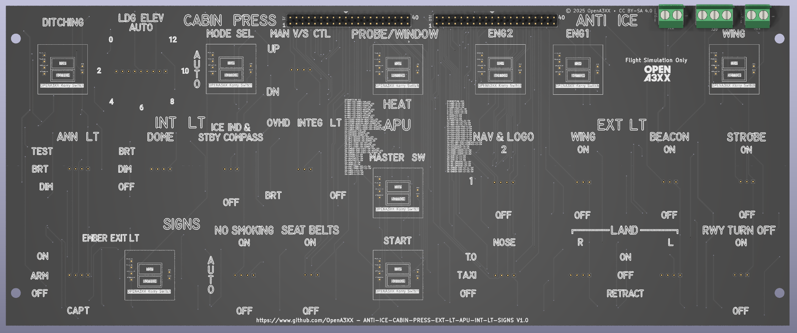

# OpenA3XX – ANTI-ICE, CABIN PRESS, EXT LT, APU, INT LT, SIGNS Panel v1.0  
**Flight Simulation Hardware – Airbus Overhead Light, Environmental, and Signage Controls**

---

## Overview

This panel replicates a major section of the **Airbus A320 overhead panel**, providing simulation functionality for:

- **Anti-ice & Probe heating**
- **Cabin pressurization**
- **External lighting**
- **APU control**
- **Interior lighting**
- **Passenger information signs**

Designed for realism and full immersion in flight simulation, the hardware consists of a custom **PCB**, **Korry-style illuminated pushbuttons**, **rotary selectors**, and a **laser-etched acrylic faceplate**.

> ⚠️ **Flight Simulation Only – Not for use in real aviation applications.**

---

## Panel Layout

The panel is divided into functional sections for realism and usability:

---

### ANTI-ICE

- **WING** – Heats leading edges of the wings.  
- **ENG1 / ENG2** – Activates engine nacelle anti-ice for respective engine.  
- **PROBE / WINDOW HEAT** – Activates heating for pitot tubes, static ports, and windshields.  
  - Includes `AUTO` label vertically silkscreened.

All positions use **Korry-style switches**, with LED indicators (`FAULT`, `ON`).

---

### 🌬 CABIN PRESS

- **MAN V/S CTL** – Manual vertical speed control (spring-loaded switch).  
- **MODE SEL** – Switches between AUTO and MAN pressurization.  
- **LDG ELEV AUTO** – Rotary switch to set landing elevation manually when not in AUTO.  
- **DITCHING** – Closes outflow valves, air inlets, and exhaust valves to prepare for ditching.

---

### EXT LT (External Lighting)

Includes 8 pushbuttons for lighting systems:

| Switch         | Function                                  |
|----------------|-------------------------------------------|
| **STROBE**     | Wingtip anti-collision strobe lights      |
| **BEACON**     | Red rotating lights (top and bottom)      |
| **WING**       | Floodlights for wing inspection           |
| **NAV & LOGO** | Position lights and vertical stabilizer logo lighting |
| **RWY TURN OFF** | Lights pointing toward runway turns      |
| **LAND L/R**   | Left and right landing lights             |
| **NOSE**       | Nose gear taxi/takeoff light              |

Pushbuttons are circular with silkscreen labels indicating states (e.g., `ON`, `OFF`, `RETRACT`).

---

### APU (Auxiliary Power Unit)

- **MASTER SW** – Controls APU master switch.  
- **START** – Initiates APU start sequence.  

Each uses a **Korry-style switch** with `FAULT`, `AVAIL`, and `ON` indications.

---

### INT LT (Internal Lighting)

| Control                    | Function                                       |
|----------------------------|------------------------------------------------|
| **OVHD INTEG LT**          | Overhead panel integrated lighting             |
| **ICE IND & STBY COMPASS** | Backlights for standby compass and ice indicator |
| **DOME**                   | Dome light with BRT, DIM, OFF states           |
| **ANN LT**                 | Annunciator test light (TEST, BRT, DIM)        |

---

### SIGNS

- **SEAT BELTS** – Passenger fasten seatbelt sign (ON/OFF)  
- **NO SMOKING** – No smoking sign (ON/OFF)  
- **SIGNS MODE** – Rotary selector for `AUTO` mode logic  
- **EMER EXIT LT** – Emergency exit lighting switch (OFF/ARM/ON)  
- **CAPT** – Controls light test mode or brightness

---

## PCB Details

  
  

---

### Connectors & Interfaces

#### J1–J10 – 40-Pin Headers
- Four 40-pin headers located along the top edge.
- Distribute signals across zones for switches and LEDs.

### CONNECTION J1

| Pin | Signal                          |
|-----|---------------------------------|
| 1   | ANTI-ICE-WING-TOP_LED           |
| 2   | ANTI-ICE-WING-BOTTOM_LED        |
| 3   | ANTI-ICE-WING-KORRY_SW          |
| 4   | ANTI-ICE-ENG1-TOP_LED           |
| 5   | ANTI-ICE-ENG1-BOTTOM_LED        |
| 6   | ANTI-ICE-ENG1-KORRY_SW          |
| 7   | ANTI-ICE-ENG2-TOP_LED           |
| 8   | ANTI-ICE-ENG2-BOTTOM_LED        |
| 9   | ANTI-ICE-ENG2-KORRY_SW          |
| 10  | PEOBE-WINDOW-HEAT-TOP_LED       |
| 11  | PEOBE-WINDOW-HEAT-BOTTOM_LED    |
| 12  | PEOBE-WINDOW-HEAT-KORRY_SW      |
| 13  | CABIN-PRESS-MODE-SEL-TOP_LED    |
| 14  | CABIN-PRESS-MODE-SEL-BOTTOM_LED |
| 15  | CABIN-PRESS-MODE-SEL-KORRY_SW   |
| 16  | DITCHING-TOP_LED                |
| 17  | DITCHING-BOTTOM_LED             |
| 18  | DITCHING-KORRY_SW               |
| 19  | APU-MASTER-SW-TOP_LED           |
| 20  | APU-MASTER-SW-BOTTOM_LED        |
| 21  | APU-MASTER-SW-KORRY_SW          |
| 22  | APU-START-SW-TOP_LED            |
| 23  | APU-START-SW-BOTTOM_LED         |
| 24  | APU-START-SW-KORRY_SW           |
| 25  | EMBER-EXIT-LIGHT-SW-TOP_LED     |
| 26  | EMBER-EXIT-LIGHT-SW-BOTTOM_LED  |
| 27  | EMBER-EXIT-LIGHT-SW-KORRY_SW    |
| 28  | STROBE_C1-SW                    |
| 29  | STROBE_C2-SW                    |
| 30  | BEACON_C1-SW                    |
| 31  | BEACON_C2-SW                    |
| 32  | WING_C1-SW                      |
| 33  | WING_C2-SW                      |
| 34  | RWY-TURN-OFF_C1-SW              |
| 35  | RWY-TURN-OFF-C2-SW              |
| 36  | LAND-L_C1-SW                    |
| 37  | LAND-L-C2-SW                    |
| 38  | LAND-L-C3-SW                    |

### CONNECTION J10

| Pin | Signal                          |
|-----|---------------------------------|
| 1   | LAND-R_C1-SW                    |
| 2   | LAND-R_C2-SW                    |
| 3   | LAND-R_C3-SW                    |
| 4   | NAV-LOGO_C1-SW                  |
| 5   | NAV-LOGO-C2-SW                  |
| 6   | NAV-LOGO-C3-SW                  |
| 7   | NOSE_C1-SW                      |
| 8   | NOSE_C2-SW                      |
| 9   | NOSE_C3-SW                      |
| 10  | MAN-VS-CTL_C1-SW                |
| 11  | MAN-VS-CTL-C2-SW                |
| 12  | MAN-VS-CTL-C3-SW                |
| 13  | LDG-ELEV-POS-1-SW               |
| 14  | LDG-ELEV-POS-2-SW               |
| 15  | LDG-ELEV-POS-3-SW               |
| 16  | LDG-ELEV-POS-4-SW               |
| 17  | LDG-ELEV-POS-5-SW               |
| 18  | LDG-ELEV-POS-6-SW               |
| 19  | LDG-ELEV-POS-7-SW               |
| 20  | LDG-ELEV-POS-8-SW               |
| 21  | ICE-ING-STBY-COMPASS-C1-SW      |
| 22  | ICE-ING-STBY-COMPASS-C2-SW      |
| 23  | SEATBEALTS-C1-SW                |
| 24  | SEATBEALTS-C2-SW                |
| 25  | DOME-LIGHTS-C1-SW               |
| 26  | DOME-LIGHTS-C2-SW               |
| 27  | DOME-LIGHTS-C3-SW               |
| 28  | ANN-LT-C1-SW                    |
| 29  | ANN-LT-C2-SW                    |
| 30  | ANN-LT-C3-SW                    |
| 31  | NO-SMOKING-C1-SW                |
| 32  | NO-SMOKING-C2-SW                |
| 33  | NO-SMOKING-C3-SW                |
| 34  | EMBER-EXIT-LT-C1-SW             |
| 35  | EMBER-EXIT-LT-C2-SW             |
| 36  | EMBER-EXIT-LT-C3-SW             |

#### J5–J8 – Terminal Blocks
- Power input (+12V / GND) for LED illumination.

#### Switch Connectors
- Each switch includes:
  - 4-pin header for Korry-style switches (top/bottom LED, signal)
  - 3-pin for toggle switches
  - 2-pin for rotary selector detents

---

### LEDs and Indicators

- **116 SMD LEDs (D1–D116)**  
  - Surround pushbuttons and rotary selectors.
  - Provide switch feedback and label illumination.

- **Current-limiting resistors (R1–R41)**

---

### Mounting and Assembly

- Panel features **corner screw holes** for easy mounting.
- Acrylic and PCB layers align via **matching hole patterns**.
- Designed for drop-in compatibility with OpenA3XX components.

---

## Fabrication and Panel Fit

### Acrylic Faceplate

- **Engraved legends**:
  - All labels (FAULT, ON, AUTO, BRT, DIM, TEST, RETRACT, etc.)
  - Section titles: ANTI ICE, EXT LT, INT LT, etc.

- **Cutouts**:
  - 7 rectangular Korry switch slots  
  - 16 circular pushbuttons  
  - 3 rotary selector holes

- **DXF Color Convention**:
  - **Red** = Front Face Panel Cuts  
  - **Blue** = Rear Panel Cuts  
  - **Green** = Laser Engravings  
  - **Orange** = Korry Legends

---

## PCB Design Reference

The routing view provides:

- **Red** = Top copper traces  
- **Blue** = Bottom copper traces  
- **Yellow** = Silkscreen labels and footprints  
- **Through-hole and SMD components** co-exist for ease of assembly

Includes clean breakout for each subsystem, allowing modular debugging and testing.

---

## 🔗 Attribution

- **Version**: ANTI-ICE, CABIN PRESS, EXT LT, APU, INT LT, SIGNS Panel v1.0  
- **Project**: [OpenA3XX](https://www.github.com/OpenA3XX)  
- **License**: CC BY-SA 4.0  
- **Note**: Design for simulation use only.
