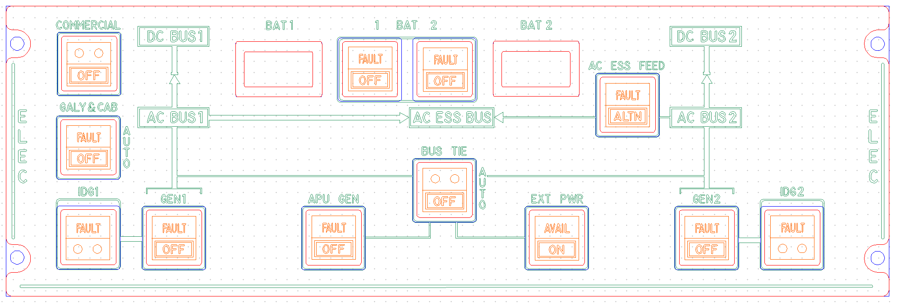

# OpenA3XX – ELEC Panel v1.0  
**Flight Simulation Hardware – Electrical Control Panel**

---

## Overview

This ELEC panel replicates the **Electrical Panel** found in Airbus aircraft, used for managing electrical power distribution including generators, battery systems, bus feeds, and external power sources.

The hardware design includes a **PCB assembly**, **front acrylic panel**, and provisions for simulation-accurate interaction using Korry-style switches and 7-segment display indicators for battery voltage.

> ⚠️ **Flight Simulation Only – Not for use in real aviation applications.**

---

## Panel Layout

The ELEC Panel is laid out to match Airbus standard schematics:

### Top Row:
- **BAT1** and **BAT2** switch indicators.
- 7-segment displays for battery voltage readings.
- **AC ESS FEED** switch with ALTN mode.
- **DC BUS1** and **DC BUS2** indicators.

### Middle Section:
- Power distribution flow through **AC BUS1**, **AC BUS2**, and **AC ESS BUS**.
- **BUS TIE** rotary switch with AUTO/OFF positions.
- **EXT PWR** switch with AVAIL and ON indicators.

### Lower Section:
- Generators and IDG controls: **GEN1**, **GEN2**, **IDG1**, **IDG2**.
- Auxiliary controls: **APU GEN**, **COMMERCIAL**, **GALY & CAB**.

---

## PCB Details

### Connectors & Interfaces

#### J2 – 40-pin Header
- Main signal interface to controller.
- Pinout includes LEDs, switches, and display interface.

#### CONNECTION J2
| Pin | Signal                  |
|-----|-------------------------|
| 1   | COMMERCIAL-TOP_LED      |
| 2   | COMMERCIAL-BOTTOM_LED   |
| 3   | COMMERCIAL-KORRY_SW     |
| 4   | IDG-1-TOP_LED           |
| 5   | IDG-1-BOTTOM_LED        |
| 6   | IDG-1-KORRY_SW          |
| 7   | APU-GEN-TOP_LED         |
| 8   | APU-GEN-BOTTOM_LED      |
| 9   | APU-GEN-KORRY_SW        |
| 10  | EXT-PWR-TOP_LED         |
| 11  | EXT-PWR-BOTTOM_LED      |
| 12  | EXT-PWR-KORRY_SW        |
| 13  | GEN-2-TOP_LED           |
| 14  | GEN-2-BOTTOM_LED        |
| 15  | GEN-2-KORRY_SW          |
| 16  | GALY-CAB-TOP_LED        |
| 17  | GALY-CAB-BOTTOM_LED     |
| 18  | GALY-CAB-KORRY_SW       |
| 19  | GEN-1-TOP_LED           |
| 20  | GEN-1-BOTTOM_LED        |
| 21  | GEN-1-KORRY_SW          |
| 22  | BUS-TIE-TOP_LED         |
| 23  | BUS-TIE-BOTTOM_LED      |
| 24  | BUS-TIE-KORRY_SW        |
| 25  | AC-ESS-BUS-TOP_LED      |
| 26  | AC-ESS-BUS-BOTTOM_LED   |
| 27  | AC-ESS-BUS-KORRY_SW     |
| 28  | IDG-2-TOP_LED           |
| 29  | IDG-2-BOTTOM_LED        |
| 30  | IDG-2-KORRY_SW          |
| 31  | BAT-1-TOP_LED           |
| 32  | BAT-1-BOTTOM_LED        |
| 33  | BAT-1-KORRY_SW          |
| 34  | BAT-2-TOP_LED           |
| 35  | BAT-2-BOTTOM_LED        |
| 36  | BAT-2-KORRY_SW          |

#### K1–K10 – Korry Switch Connectors
- Connectors for:
  - BAT1, BAT2
  - GEN1, GEN2
  - IDG1, IDG2
  - APU GEN, EXT PWR
  - AC ESS FEED

#### J2, J3 – External 7-Segment Interface Headers
- Connected to external driver (e.g., MAX7219).
- Displays voltage for BAT1 and BAT2.

#### J4 – Rotary Switch for BUS TIE
- 3-pin interface for OFF/AUTO detection.

#### J5 – Power Supply
- Terminal block to power onboard components and LED circuits.

---

## LEDs and Indicators

- 85+ yellow LEDs used for:
  - Backlighting switch areas.
  - Highlighting rotary switch positions.
  - Illuminating legend indicators.

- Two 3-digit 7-segment displays:
  - BAT1 and BAT2 voltage display.
  - Common anode layout with external driver control.

---

## Mounting and Assembly

- 4 corner mounting holes.
- Panel and PCB screw layout are aligned for secure stacking.
- Acrylic front panel includes:
  - Engraved legend for all controls.
  - Slots for all switches and indicators.
  - Routed channels for rotary and 7-segment displays.

---

## Fabrication and Panel Fit

### Acrylic Faceplate:
- Color-coded preview:
  - Red = Front Panel  
  - Blue = Back Panel  
  - Green = Engraving  
  - Orange = Korry Labels

- Laser-engraved legends include:
  - Switch labels: `COMMERCIAL`, `GALY & CAB`, `EXT PWR`, etc.
  - Bus names: `AC BUS1`, `DC BUS2`, `AC ESS FEED`, `BUS TIE`
  - Voltage display windows for `BAT1` and `BAT2`
  - Graphic bus connections mimicking Airbus electrical schematic.

---

## PCB Design Reference

- Red = Top copper traces  
- Blue = Bottom copper traces  
- Yellow = Silkscreen legends  
- Routing and via structure supports through-hole and SMD components

---

## 🔗 Attribution

- **Version**: ELEC Panel v1.0  
- **Project**: [OpenA3XX](https://www.github.com/OpenA3XX)  
- **License**: CC BY-SA 4.0  
- **Note**: Design for simulation use only.