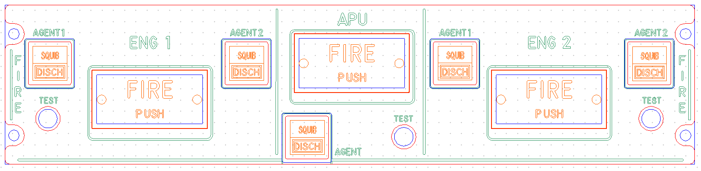
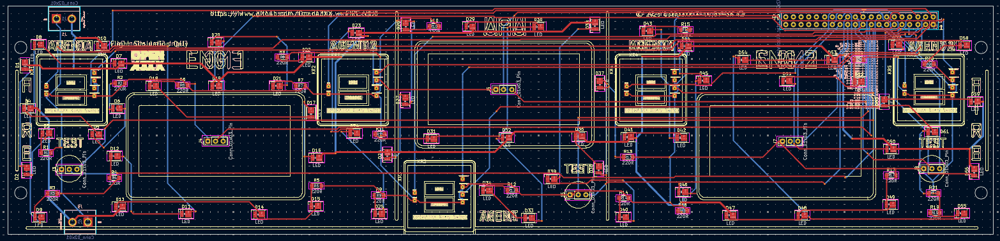
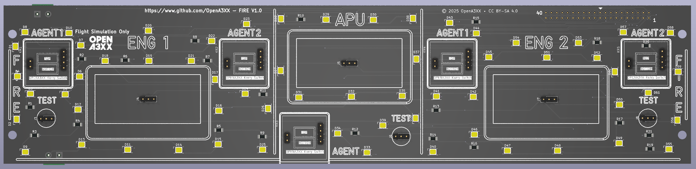
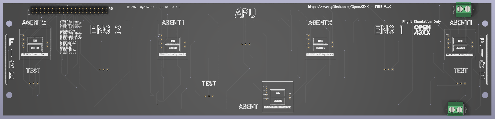

# OpenA3XX – FIRE Panel v1.0

**Flight Simulation Hardware – FIRE Control Panel**

---

## Overview

The FIRE panel replicates the fire protection interface found in Airbus cockpits. It enables simulated control of engine and APU fire suppression, including squib and discharge actions, fire push button operation, and fire test initiation.

This simulation-grade hardware includes integrated support for:

- **Three FIRE PUSH modules** (ENG1, APU, ENG2)
- **Agent discharge control** (2 per engine/APU)
- **Test buttons**
- **Illuminated Korry-style switches**

> ⚠️ **Flight Simulation Only – Not for use in real aviation applications.**

---

## Panel Layout

The FIRE Panel is divided into 3 main fire sections:

### Left Section – Engine 1:

- **ENG 1 FIRE PUSH** module (centered)
- **AGENT 1** and **AGENT 2** switches:
    - SQB and DISCH labeled Korry-style switches
- **TEST** button on the bottom left
- Side legend vertically labeled “FIRE”

### Center Section – APU:

- **APU FIRE PUSH** module (centered)
- **AGENT** discharge switch
- **TEST** button directly underneath

### Right Section – Engine 2:

- **ENG 2 FIRE PUSH** module (centered)
- **AGENT 1** and **AGENT 2** switches:
    - Same layout as Engine 1
- **TEST** button on the bottom right
- Side legend labeled “FIRE”

All switches are designed for use with illuminated Korry-compatible modules.

---

## PCB Details

  
  

### Connectors & Interfaces

#### J2 – 40-pin Main Header

- Positioned at top-left of PCB
- Connects to the simulator controller
- Supports inputs for:
    - 6x AGENT switches (top & bottom)
    - 3x FIRE PUSH modules
    - 3x TEST buttons
    - LED signals for SQB/DISCH/FIRE
- Pinout follows standard OpenA3XX matrix mapping

#### CONNECTION J2

| Pin | Signal                      |
| --- | --------------------------- |
| 1   | ENGINE-1-AGENT-1-TOP_LED    |
| 2   | ENGINE-1-AGENT-1-BOTTOM_LED |
| 3   | ENGINE-1-AGENT-1-KORRY_SW   |
| 4   | ENGINE-1-AGENT-2-TOP_LED    |
| 5   | ENGINE-1-AGENT-2-BOTTOM_LED |
| 6   | ENGINE-1-AGENT-2-KORRY_SW   |
| 7   | APU-AGENT-TOP_LED           |
| 8   | APU-AGENT-BOTTOM_LED        |
| 9   | APU-AGENT-KORRY_SW          |
| 10  | ENGINE-2-AGENT-1-TOP_LED    |
| 11  | ENGINE-2-AGENT-1-BOTTOM_LED |
| 12  | ENGINE-2-AGENT-1-KORRY_SW   |
| 13  | ENGINE-2-AGENT-2-TOP_LED    |
| 14  | ENGINE-2-AGENT-2-BOTTOM_LED |
| 15  | ENGINE-2-AGENT-2-KORRY_SW   |
| 16  | ENGINE-1-TEST-SW-0          |
| 17  | ENGINE-1-TEST-SW-1          |
| 18  | ENGINE-1-FIRE-SW            |
| 19  | ENGINE-1-FIRE-LIGHT         |
| 20  | APU-FIRE-SW                 |
| 21  | APU-FIRE-LIGHT              |
| 22  | APU-TEST-SW-0               |
| 23  | APU-TEST-SW-1               |
| 24  | ENGINE-2-FIRE-SW            |
| 25  | ENGINE-2-FIRE-LIGHT         |
| 26  | ENGINE-2-TEST-SW-0          |
| 27  | ENGINE-2-TEST-SW-1          |

#### Power Terminals

- 2x 2-pin terminal blocks at either end of the board
- Provide VCC/GND for LED lighting

---

### LEDs and Indicators

- 60+ SMD yellow LEDs distributed throughout the board:
    - Surround each AGENT and FIRE PUSH module
    - Surround TEST buttons
    - Positioned to highlight switch areas and indicators
- Each LED is paired with a current-limiting resistor

---

### Mounting and Assembly

- 4 corner mounting holes
- Screw spacing matches front acrylic panel
- Alignment ensured by:
    - Legend markers for FIRE modules and agents
    - Vertical FIRE engravings on side panels

---

## Fabrication and Panel Fit

### Acrylic Faceplate:

- CNC-cut and laser-engraved
- Clearly marked:
    - `FIRE PUSH`
    - `AGENT 1`, `AGENT 2`
    - `SQB`, `DISCH`
    - `TEST`, `APU`, `ENG 1`, `ENG 2`
- Color-coded preview:
    - Red = Front Panel outline
    - Green = Engraved text
    - Blue = Cutouts
    - Orange = Korry Legends

---

## PCB Design Reference

The routing view shows:

- Red = Top Layer Traces
- Blue = Bottom Layer Traces
- Yellow = Silkscreen and Footprints
- Components clearly identified (R1–R60+, D1–D60+)

---

## 🔗 Attribution

- **Version**: FIRE Panel v1.0
- **Project**: [OpenA3XX](https://www.github.com/OpenA3XX)
- **License**: CC BY-SA 4.0
- **Note**: Design for simulation use only.
