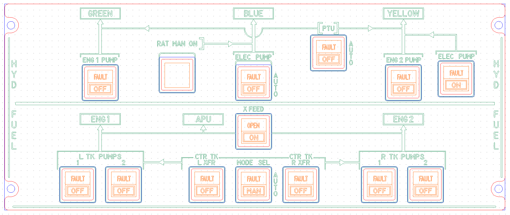

# OpenA3XX – HYD & FUEL Panel v1.0

**Flight Simulation Hardware – Hydraulic & Fuel Control Panel**

---

## Overview

This HYD & FUEL panel replicates the hydraulic and fuel system control panels found in Airbus aircraft. It includes multiple pushbutton switch modules with `FAULT` and `OFF/ON` legends, one 7-segment display zone (for RAT), and a wide range of hydraulic and fuel switches organized per system.

The design includes a **PCB**, **acrylic front panel**, and **component silk overlays** to replicate accurate cockpit hardware interaction using Korry-style switches.

> ⚠️ **Flight Simulation Only – Not for use in real aviation applications.**

---

## Panel Layout

The HYD & FUEL panel consists of two horizontally arranged system zones:

### Top Half – Hydraulic System:

- **GREEN**, **BLUE**, and **YELLOW** hydraulic circuits.
- Switches for:
    - ENG 1 PUMP
    - ELEC PUMP (Blue)
    - PTU
    - ENG 2 PUMP
    - ELEC PUMP (Yellow)
- **RAT MAN ON** area (with display placeholder).

### Bottom Half – Fuel System:

- Dual sets of **L TK PUMPS** and **R TK PUMPS** (1 and 2).
- **CTR TK L XFR** and **CTR TK R XFR** for center tank transfer.
- **MODE SEL** switch for auto/manual.
- **X FEED** switch.
- **APU** path indication between fuel lines.
- Clear hydraulic/fuel silkscreen paths connecting systems and engines.

---

## PCB Details

### Connectors & Interfaces

#### Dual 40-Pin Headers

- Located at the top-left and top-right.
- Interface for all Korry switch modules, LEDs, and signal traces.
- Pin silkscreen labeled 1–40 for each connector.

#### CONNECTION J2

| Pin | Signal                      |
| --- | --------------------------- |
| 1   | ENG-1-PUMP-TOP_LED          |
| 2   | ENG-1-PUMP-BOTTOM_LED       |
| 3   | ENG-1-PUMP-KORRY_SW         |
| 4   | L-TK-PUMPS-2-TOP_LED        |
| 5   | L-TK-PUMPS-2-BOTTOM_LED     |
| 6   | L-TK-PUMPS-2-KORRY_SW       |
| 7   | ELEC-PUMP-TOP_LED           |
| 8   | ELEC-PUMP-BOTTOM_LED        |
| 9   | ELEC-PUMP-KORRY_SW          |
| 10  | MODE_SEL-TOP_LED            |
| 11  | MODE_SEL-BOTTOM_LED         |
| 12  | MODE_SEL-KORRY_SW           |
| 13  | CTR-TK-R-XFR-TOP_LED        |
| 14  | CTR-TK-R-XFR-BOTTOM_LED     |
| 15  | CTR-TK-R-XFR-KORRY_SW       |
| 16  | R-RTK-PUMPS-1-TOP_LED       |
| 17  | R-RTK-PUMPS-1-BOTTOM_LED    |
| 18  | R-RTK-PUMPS-1-KORRY_SW      |
| 19  | ELEC-PUMP-YELLOW-TOP_LED    |
| 20  | ELEC-PUMP-YELLOW-BOTTOM_LED |
| 21  | ELEC-PUMP-YELLOW-KORRY_SW   |
| 22  | L-TK-PUMPS-1-TOP_LED        |
| 23  | L-TK-PUMPS-1-BOTTOM_LED     |
| 24  | L-TK-PUMPS-1-KORRY_SW       |
| 25  | CTR-TK-L-XFR-TOP_LED        |
| 26  | CTR-TK-L-XFR-BOTTOM_LED     |
| 27  | CTR-TK-L-XFR-KORRY_SW       |
| 28  | X-FEED-TOP_LED              |
| 29  | X-FEED-BOTTOM_LED           |
| 30  | X-FEED-KORRY_SW             |
| 31  | PTU-TOP_LED                 |
| 32  | PTU-BOTTOM_LED              |
| 33  | PTU-KORRY_SW                |
| 34  | ENG-2-PUMP-TOP_LED          |
| 35  | ENG-2-PUMP-BOTTOM_LED       |
| 36  | ENG-2-PUMP-KORRY_SW         |
| 37  | R-RTK-PUMPS-2-TOP_LED       |
| 38  | R-RTK-PUMPS-2-BOTTOM_LED    |
| 39  | R-RTK-PUMPS-2-KORRY_SW      |

#### CONNECTION J1

| Pin | Signal                |
| --- | --------------------- |
| 1   | RAT-MAN-ON-TOP_LED    |
| 2   | RAT-MAN-ON-BOTTOM_LED |
| 3   | RAT-MAN-ON-KORRY_SW   |

#### Terminal Blocks

- Two 2-pin screw terminal blocks for power input at each corner.

#### Switch Modules

- 14 Korry-style switch modules with:
    - TOP (FAULT) and BOTTOM (OFF/ON or MAN/AUTO) buttons.
    - 4-pin headers (K1–K14) for connecting each switch.

---

### LEDs and Indicators

- Over 90 SMD yellow LEDs (D1–D90+) are distributed to:
    - Illuminate around each switch zone.
    - Backlight FAULT and ON indicators.
    - Highlight RAT MAN ON zone.
- Each LED is paired with a resistor (R1–R35 approx.) for current limiting.

---

### Mounting and Assembly

- Acrylic panel matches PCB mounting holes for aligned sandwich assembly.
- Top silkscreen includes clear labels for:
    - HYDRAULIC: ENG PUMPs, ELEC PUMPs, PTU, RAT
    - FUEL: TK PUMPs, XFRs, MODE, FEED
    - Labeled flow paths and AUTO indicators.

---

## Fabrication and Panel Fit

### Acrylic Faceplate:

- CNC-milled to fit:
    - 14 Korry-style switch modules
    - Display window for RAT
- Engraved legends:
    - `ENG 1 PUMP`, `ELEC PUMP`, `PTU`, `ENG 2 PUMP`, `RAT MAN ON`
    - `L TK PUMPS`, `CTR TK XFR`, `MODE SEL`, `R TK PUMPS`
    - `X FEED`, `APU`, `ENG 1`, `ENG 2`, `AUTO`, `FAULT`, `OFF`, `ON`, `MAN`
- Color-coded design layers:
    - Red = Front Panel
    - Blue = Rear Panel
    - Green = Engraving
    - Orange = Switch Legends

---

## PCB Design Reference

Routing view (KiCad style):

- Red = Top signal layer
- Blue = Bottom layer
- Yellow = Silkscreen outlines
- Clear via paths and LED networks for uniform lighting and function control

---

## 🔗 Attribution

- **Version**: HYD & FUEL Panel v1.0
- **Project**: [OpenA3XX](https://www.github.com/OpenA3XX)
- **License**: CC BY-SA 4.0
- **Note**: Design for simulation use only.
