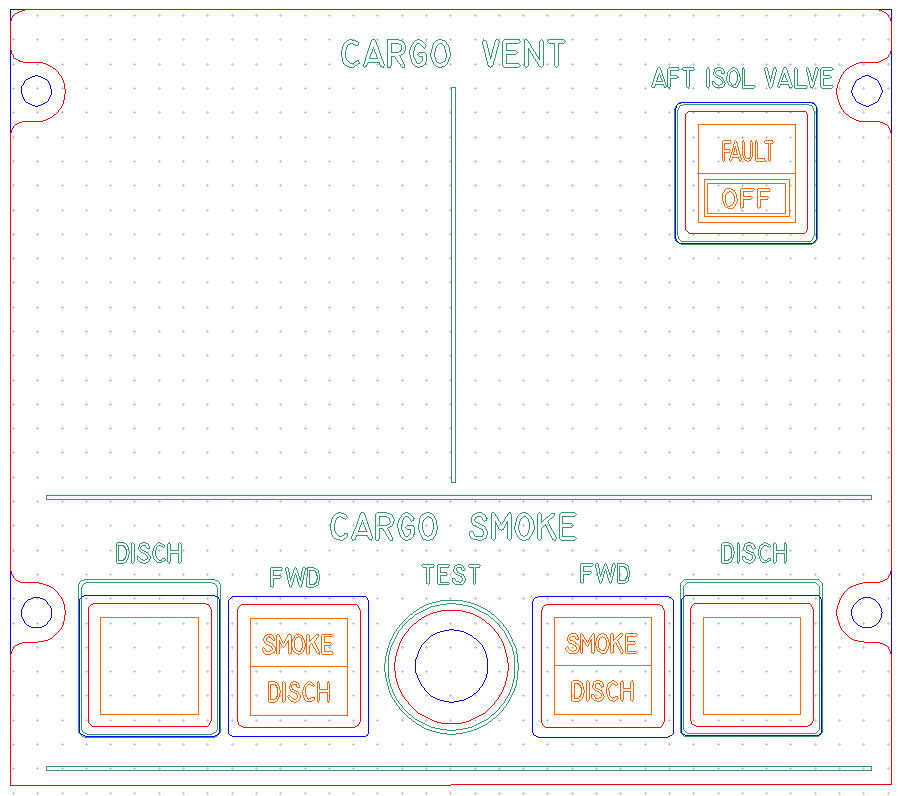
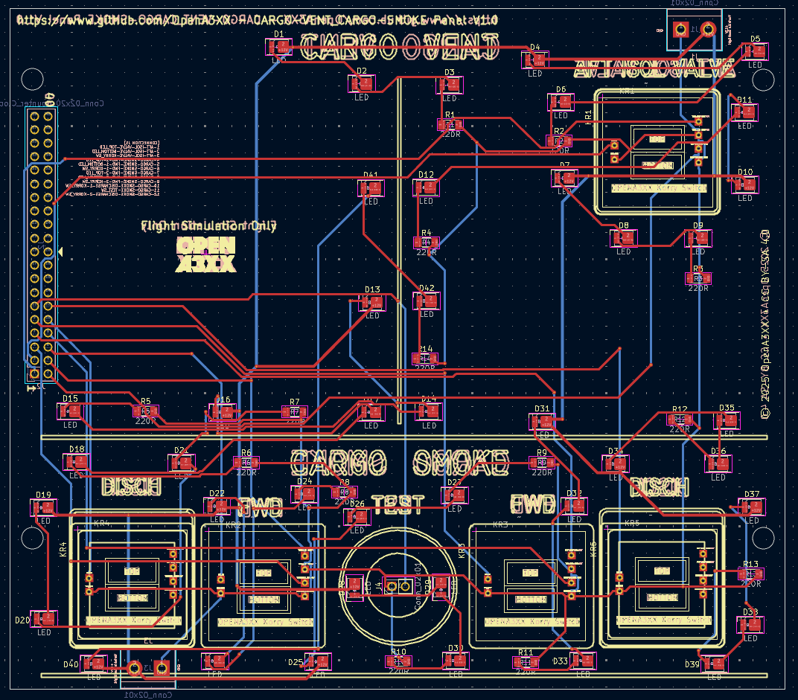
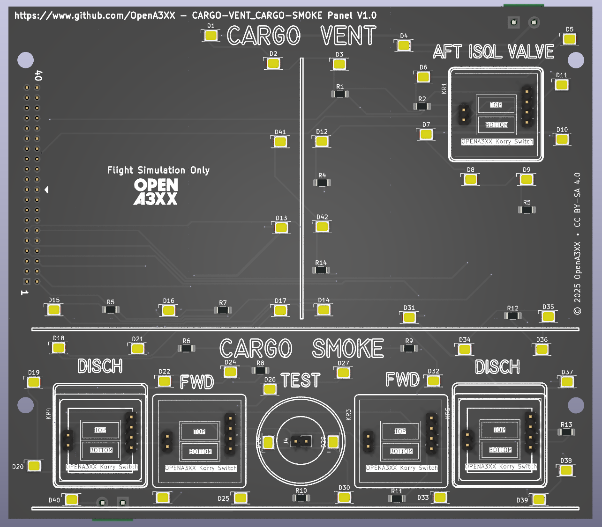
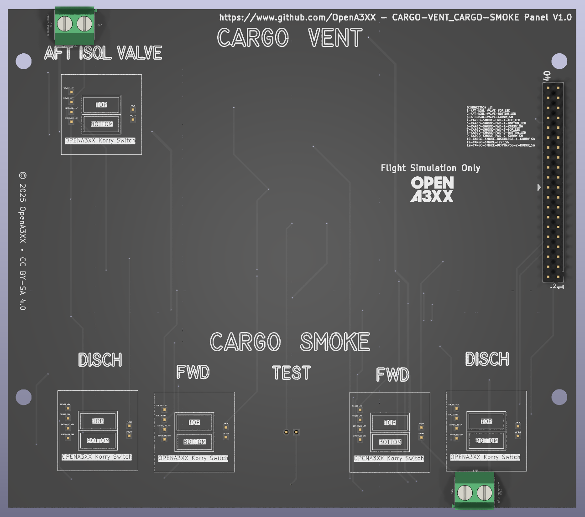

# OpenA3XX – Cargo Vent & Cargo Smoke Panel v1.0  
**Flight Simulation Hardware – CARGO VENT & CARGO SMOKE Panel**

---

## Overview

This panel replicates the **Cargo Ventilation and Cargo Smoke Detection & Discharge controls** as found in Airbus aircraft.  
The hardware integrates both the AFT ISOL VALVE control and the CARGO SMOKE pushbuttons.

Includes:
- 1x Korry-style switch for **AFT ISOL VALVE**.
- 4x Korry-style switches for **SMOKE DISCHARGE** and indicators (FWD/REAR).
- 1x TEST pushbutton with illumination.
- Dual-section design for **CARGO VENT** and **CARGO SMOKE** functionalities.

> ⚠️ **Flight Simulation Only – Not for use in real aviation applications.**

---

## Panel Layout

**Top Section – CARGO VENT**
- Label: "CARGO VENT" centered.
- AFT ISOL VALVE switch positioned top-right with `FAULT`/`OFF` legends.

**Bottom Section – CARGO SMOKE**
- Label: "CARGO SMOKE" centered.
- From left to right:
  - Leftmost `DISCH` square legend (indicator only).
  - `FWD` SMOKE DISCH Korry (left).
  - `TEST` pushbutton centered.
  - `FWD` SMOKE DISCH Korry (right).
  - Rightmost `DISCH` indicator legend.

---

## PCB Details

### Connectors & Interfaces

#### J2 – 40-pin Header
- Main I/O interface for all switches and LEDs.

##### CONNECTION J2
| Pin | Signal                          |
|-----|---------------------------------|
| 1   | AFT-ISOL-VALVE-TOP_LED          |
| 2   | AFT-ISOL-VALVE-BOTTOM_LED       |
| 3   | AFT-ISOL-VALVE-KORRY_SW         |
| 4   | CARGO-SMOKE-FWD-1-TOP_LED       |
| 5   | CARGO-SMOKE-FWD-1-BOTTOM_LED    |
| 6   | CARGO-SMOKE-FWD-1-KORRY_SW      |
| 7   | CARGO-SMOKE-FWD-2-TOP_LED       |
| 8   | CARGO-SMOKE-FWD-2-BOTTOM_LED    |
| 9   | CARGO-SMOKE-FWD-2-KORRY_SW      |
| 10  | CARGO-SMOKE-DISCHARGE-1-KORRY_SW|
| 11  | CARGO-SMOKE-TEST_SW             |
| 12  | CARGO-SMOKE-DISCHARGE-2-KORRY_SW|

#### Korry Switch Connectors
- 4-pin headers labeled KR1–KR5.
- Designed for OpenA3XX Korry-style switch modules.

#### TEST Pushbutton
- Standard illuminated pushbutton footprint.

#### Terminal Blocks
- 2-pin green screw terminals at top-left and bottom-right.
- Provide +12V and GND power to panel lighting.

---

## LEDs and Indicators

- 42 yellow SMD LEDs labeled D1–D42.
- Used for:
  - Illuminating Korry switch outlines.
  - Backlighting legends (DISCH, FAULT, OFF).
  - TEST button and vertical divider illumination.

Each LED has an inline 220-ohm current-limiting resistor (R1–R14).

---

## Mounting and Assembly

- 4 corner holes for mounting into cockpit enclosure.
- CNC-cut acrylic matches PCB exactly.
- Includes silkscreen legends for:
  - Component IDs.
  - Alignment of Korry modules.
  - Mechanical guides.

---

## Fabrication and Panel Fit

### Acrylic Faceplate:
- Laser-engraved legends:
  - Top: `CARGO VENT`, `AFT ISOL VALVE`
  - Bottom: `CARGO SMOKE`, `DISCH`, `SMOKE`, `TEST`, `FWD`, `OFF`, `FAULT`
- Color-coded design for fabrication:
  - Red = Front outline
  - Blue = Rear backing panel
  - Green = Text engraving
  - Orange = Legend highlights

---

## PCB Design Reference

Routing View (from KiCad):
- Red = Top traces  
- Blue = Bottom traces  
- Yellow = Silkscreen  
- Labels include part positions, net traces, and power lines.

---

## 🔗 Attribution

- **Version**: Cargo Vent & Cargo Smoke Panel v1.0  
- **Project**: [OpenA3XX](https://www.github.com/OpenA3XX)  
- **License**: CC BY-SA 4.0  
- **Note**: Design for simulation use only.
