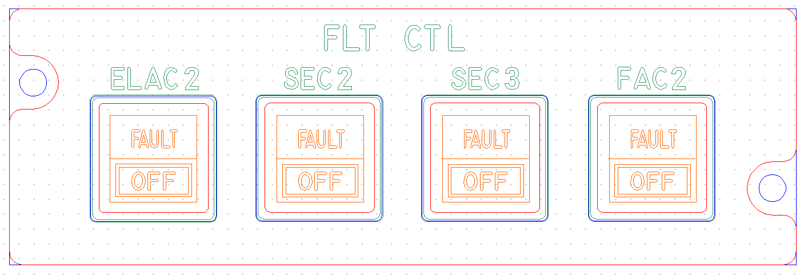
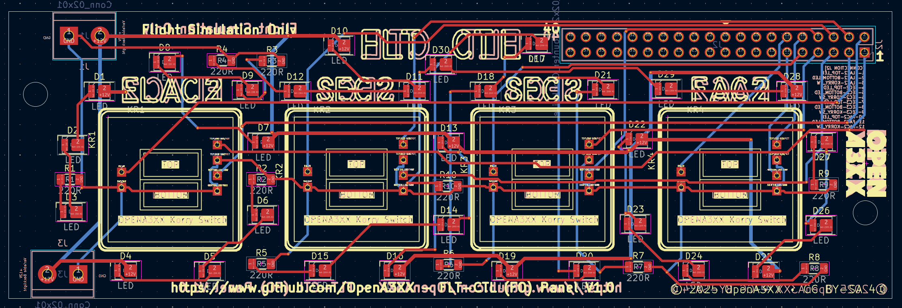
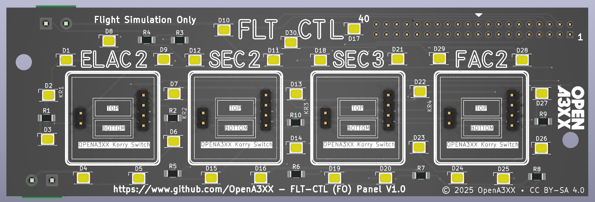
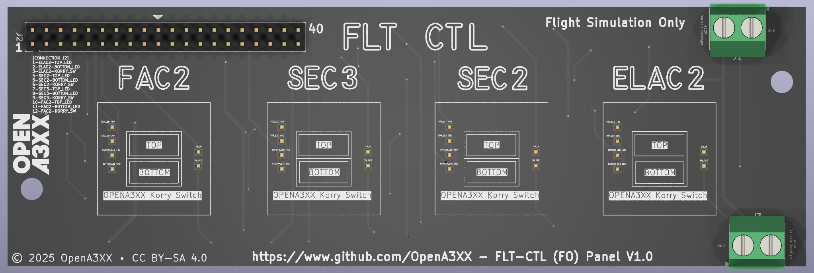

# OpenA3XX – FLT CTL (FO) Panel v1.0  
**Flight Simulation Hardware – Flight Control Panel (FO Side)**

---

## Overview

This panel replicates the **First Officer's side** of the Flight Control (FLT CTL) controls in an Airbus cockpit. It is part of the flight control monitoring interface and includes 4 Korry-style switches for managing and observing the status of ELAC2, SEC2, SEC3, and FAC2 modules.

The design integrates tactile switches and illumination through surface-mount yellow LEDs around each Korry, mounted on a dedicated PCB behind a labeled acrylic faceplate.

> ⚠️ **Flight Simulation Only – Not for use in real aviation applications.**

---

## Panel Layout

The layout is symmetric and consists of:

- **ELAC2**, **SEC2**, **SEC3**, **FAC2**
  - Each section includes:
    - A rectangular cutout for a Korry-style dual switch.
    - Legends for each function: `FAULT` and `OFF`.
    - LED cutouts positioned around each switch to provide backlighting.
    - Top legends in green and switch labels in orange (engraved and backlit).

A central "FLT CTL" legend is engraved at the top middle of the panel.

---

## PCB Details

  
  

### Connectors & Interfaces

#### J2 – 40-pin Header
- Main connection header, located top-right.
- Labeled pins provide connectivity to each switch and LED.

##### Signal Mapping:
| Pin | Signal             |
|-----|--------------------|
| 1   | ELAC2-TOP_LED      |
| 2   | ELAC2-BOTTOM_LED   |
| 3   | ELAC2-KORRY_SW     |
| 4   | SEC2-TOP_LED       |
| 5   | SEC2-BOTTOM_LED    |
| 6   | SEC2-KORRY_SW      |
| 7   | SEC3-TOP_LED       |
| 8   | SEC3-BOTTOM_LED    |
| 9   | SEC3-KORRY_SW      |
| 10  | FAC2-TOP_LED       |
| 11  | FAC2-BOTTOM_LED    |
| 12  | FAC2-KORRY_SW      |

#### KR1–KR4 – Korry Switch Headers
- Located near each switch position.
- Each is a 4-pin header designed for interfacing OpenA3XX Korry modules.

#### J1, J3 – Terminal Blocks
- Positioned on left and right for 12V power and GND.
- Used to power LEDs and backlighting uniformly.

---

### LEDs and Indicators

- 28 yellow SMD LEDs (D1–D28), placed in pairs around each switch for backlighting and functional indication.
- Each LED has an associated current-limiting resistor (R1–R9) directly beside it.

---

### Mounting and Assembly

- 4 corner mounting holes for attachment to cockpit frame.
- Alignment markers on silkscreen and acrylic panel ensure accurate placement of Korry modules.
- Artwork and milling match the position of:
  - Each Korry switch cutout
  - Backlight LED regions
  - Component boundaries

---

## Fabrication and Panel Fit

### Acrylic Faceplate:
- CNC-milled cutouts for:
  - 4 Korry-style dual switches (FAULT/OFF).
- Laser-engraved legends:
  - Top: "FLT CTL"
  - Unit labels: `ELAC2`, `SEC2`, `SEC3`, `FAC2`
  - Switch labels: `FAULT`, `OFF`
- Color-coded visual representation:
  - **Red** = Outer perimeter (cut outline)
  - **Blue** = Back plate alignment
  - **Green** = Engraving
  - **Orange** = Switch legend fills

---

## PCB Design Reference

The KiCad-style routing view:
- **Red** = Top layer signal traces  
- **Blue** = Bottom layer routing  
- **Yellow** = Component outlines and silkscreen  
- Vias and pads are optimized for hand assembly or machine production.

---

## 🔗 Attribution

- **Version**: FLT CTL FO Panel v1.0  
- **Project**: [OpenA3XX](https://www.github.com/OpenA3XX)  
- **License**: CC BY-SA 4.0  
- **Note**: Design for simulation use only.
