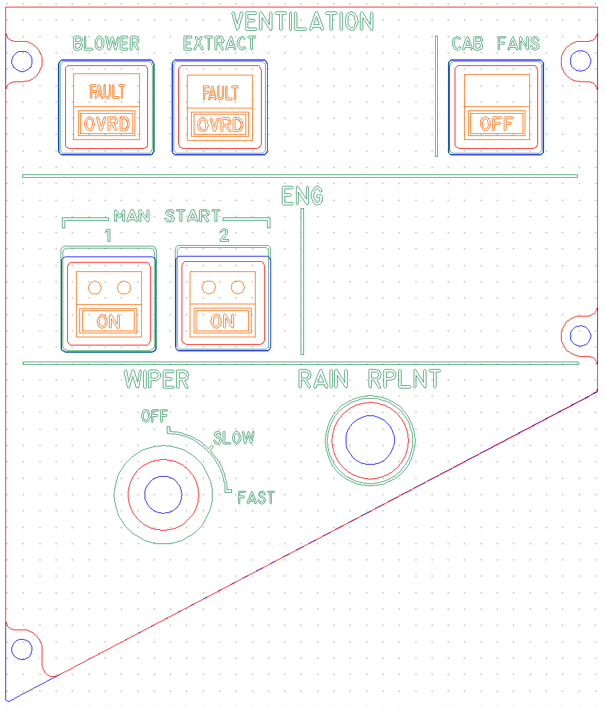
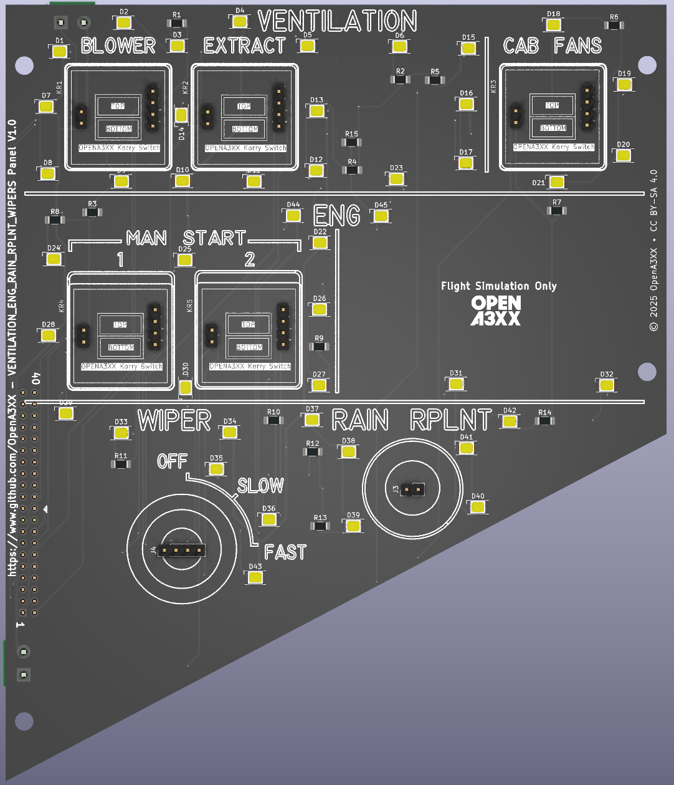
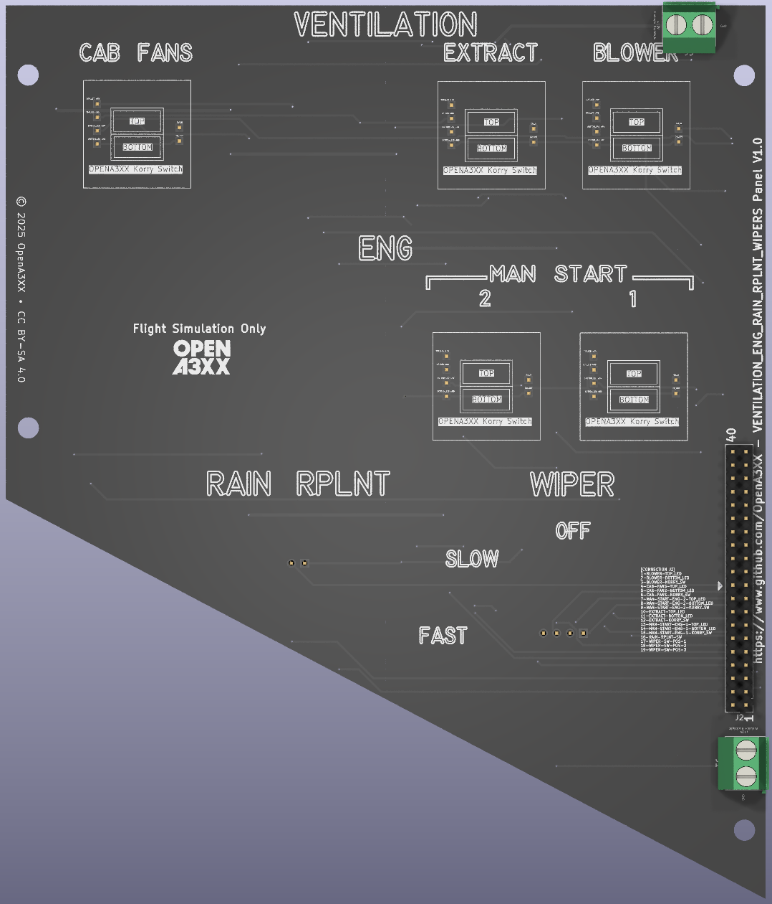
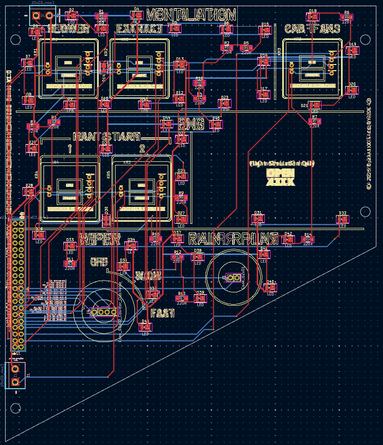

# VENTILATION / ENG / RAIN RPLNT / WIPERS Panel (FO)

This panel is part of the overhead section in the Airbus A320 family aircraft and includes several critical systems for cockpit environmental control, engine startup, windshield clearing, and rain repellent deployment.

It features the following sections:

- **VENTILATION**: Controls for BLOWER and EXTRACT fans, and CABIN FANS.
- **ENG**: Manual engine start controls for engines 1 and 2.
- **WIPER**: Wiper speed selection.
- **RAIN RPLNT**: Rain repellent activation.

> ⚠️ **Flight Simulation Only – Not for use in real aviation applications.**

---

## Panel Design

### Acrylic Panel (Front Plate)

---

## PCB Design

### 3D Front View

### 3D Back View

### PCB Layout (with traces)

---

## Switch Descriptions

#### J2 – 40-pin Header

| Pin | Signal                    |
|-----|---------------------------|
| 1   | BLOWER-TOP_LED            |
| 2   | BLOWER-BOTTOM_LED         |
| 3   | BLOWER-KORRY_SW           |
| 4   | CAB-FANS-TOP_LED          |
| 5   | CAB-FANS-BOTTOM_LED       |
| 6   | CAB-FANS-KORRY_SW         |
| 7   | MAN-START-ENG-2-TOP_LED   |
| 8   | MAN-START-ENG-2-BOTTOM_LED|
| 9   | MAN-START-ENG-2-KORRY_SW  |
| 10  | EXTRACT-TOP_LED           |
| 11  | EXTRACT-BOTTOM_LED        |
| 12  | EXTRACT-KORRY_SW          |
| 13  | MAN-START-ENG-1-TOP_LED   |
| 14  | MAN-START-ENG-1-BOTTOM_LED|
| 15  | MAN-START-ENG-1-KORRY_SW  |
| 16  | RAIN-RPLNT-SW             |
| 17  | WIPER-SW-POS-1            |
| 18  | WIPER-SW-POS-2            |
| 19  | WIPER-SW-POS-3            |

### VENTILATION

- **BLOWER** - FAULT/OVRD pushbutton
- **EXTRACT** - FAULT/OVRD pushbutton
- **CAB FANS** - OFF pushbutton

### ENG (Engine Manual Start)

- **ENG 1 ON** - Pushbutton switch
- **ENG 2 ON** - Pushbutton switch

### WIPER

- Rotary selector with positions:
  - OFF
  - SLOW
  - FAST

### RAIN RPLNT

- Pushbutton for RAIN REPELLENT application

---

---

## 🔗 Attribution

- **Version**: Ventilation, Engine, Rain Repellent Wipers v1.0  
- **Project**: [OpenA3XX](https://www.github.com/OpenA3XX)  
- **License**: CC BY-SA 4.0  
- **Note**: Design for simulation use only.
