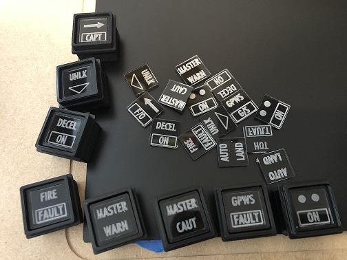
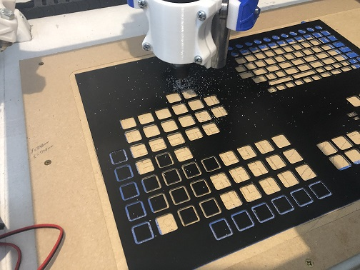
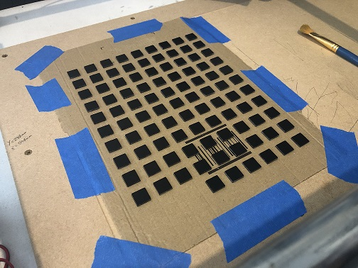
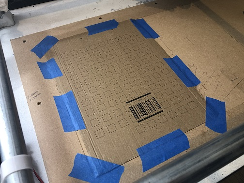
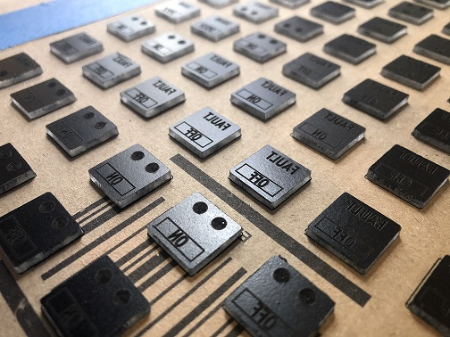
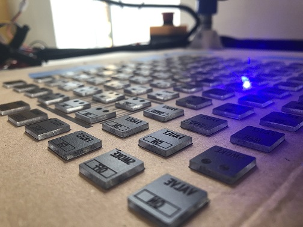
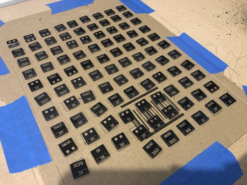
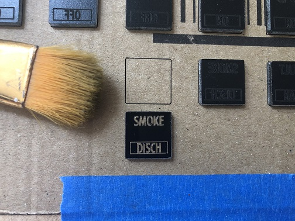

# Acrylic Inlays

## How To Order To Be Made

If you do not have access to your own CNC machine, you can always send off for the parts to be made.  
There are numerous companies out there that will machine parts for you. Cost varies depending on the material and size etc, but it is a possible solution.


You need to remember that one side needs to be painted black **BEFORE** the engraving. Please check with the company that this can be done before placing an order.


You need to ask for it to made with 2mm clear **cast** acrylic. Remember to ask for one side to be painted black before it's cut.  
Simply send the company the required DXF file and they should be able to do the rest.

### Order From OpenA3XX

We are considering the possibility of holding stock of some items such as these acrylic inlays that might be slightly more difficult for people to get their hands on. This is not something we currently offer, but if we recieve enough interest on this then we will put the service in place. If this is something you would like, please let us know. The best place to do this is on the 'Suggestions' channel in the [Discord.](https://discord.gg/55aufspsDs)

## How To Make Yourself

Making the inlays is a fairly straight forward process.  
We highly reccomend making these with Acrylic and a CNC \(optional laser\).   
_\(You could technically 3D print these with a clear filament, but you would then need to paint out the back around the text by hand. So, although it is possible, the time and complexity of making it through 3D printing is outweighed by the speed and efficiency of making these from Acrylic\)._  
  
We do not reccomend any particular brand or product, but we have used a cheap £25~ laser add on for our engraving. It is a simple case of just replacing the spindle in the CNC machine with the laser.  
This will **not** cut the material, so there is still a need for the actual spindle, but it does gives a much higher quality finish \(and higher resolution\) for the engraving.  
It is not **essential**, and you can still acheive great results with just the CNC spindle and no laser.


 With this being an open source project though, we would greatly welcome a different solution for 3D printing to add to the project. If you have some ideas, please feel free to submit them in the community contribution section where the team can review it.


### CNC Only

If you will be making the acrylic inlays with only a CNC, then the method is slightly different that if you were to use a laser for the engraving.  
Simply download the Korry switch legend DXF files _\(they are sperated out into different sections of the aircraft so you can easily find the one\(s\) you need\)_.  
Get a sheet of 2mm **cast** acrylic _\(do not use extruded acrylic!\)_ and paint one side of it matt black.  
Then it's simply a case of inputting the DXF file into your CNC software and telling it to engrave the text first, then cut out the piece after all engraving is complete. You can do as many \(or few\) as you need in one cut.


Make sure you use the mirrored versions to engrave, otherwise they will be backwards!


We recommend making them in this order as it is the most straight foward and means you won't have to worry about aligning the parts for engraving on a second pass.

### CNC & Laser Engraving

The method is slightly different here. We need to cut out the pieces first, and then engrave.  
This is actually the best way for ensuring things line up. If you have a laser powerful enough to cut the acrylic, then you could do it the same as the method above. But, we will be using a spindle to first cut out the parts, and then a laser to engrave them.  
So, as above take a sheet of 2mm **cast** acrylic _\(do not use extruded acrylic!\)_ and paint one side of it matt black. Then take the DXF file and in Estlcam tell it to only cut out the piece\(s\).

Now with a pile of unengraved inlays, we need to do some work in lightburn to set up the engraving.  
We need to create 2 seperate files. One outline only, and the second is the actual engraving file.  
We first take a sheet of carboard and lay this on our work surface, then run the outline only file. This will give us the exact positions to place our inlays ready for engraving \(make sure you place them paint side up!\). When they are all in place, they're ready to engrave!

Now you simply run the engrave file and watch the laser work its magic!  
When the engraving is complete, you will see that there is still a layer of paint where the engraving is. This is perfectly normal, simply take a soft bristle brush and give them a quick brush over to get rid of the burnt paint, and you will be left with a perfect engraving.


Because the laser leaves such a clean finish, you may find that the LED shining through is a bit bright for your tastes. You can grab a spray can of 'automotive lens tint', or 'transparant black' and spray the engraved side lightly. This will dull down the luminence and spread the light more evenly.


## Step-by-step with Estlcam

Our CNC software of choice is Estlcam. You can find out more about it in the CNC Introduction page.  
There are many other solutions out there, and we are in no way affiliated with Estlcam.  
It is free to use with some waiting limitations, but you can support the developer by paying a small fee and remove the waiting limitations.  
With that said, here is a step-by-step guide to making the acrylic inlays using Estlcam.


Step-by-step guide will be uploaded here soon. It is still currently under development.


## Step-by-step with Lightburn

Our laser software of choice is Lightburn. You can find out more about it in the CNC Laser Information page. There are many other solutions out there, and we are in no way affiliated with Lightburn.  
It is free to use for a trial period, and then there is a need to purchase a license for full features.  
With that said, here is a step-by-step guide to setting up the laser engraving in Lightburn.


Step-by-step guide will be uploaded here soon. It is still currently under development.


