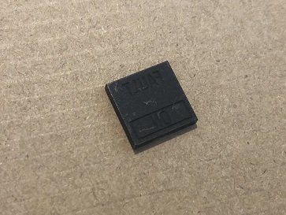

# Getting Started

## What You Need

In order to build one of our Korry switches, you will need:

### **Parts & Components**

1x 3D printed outer shell  
1x 3D printed inner shell  
1x Acrylic inlay \(see below for more detail\)  
1x PCB \(see PCB page for more details\)  
2x Square LED \(2mm x 3mm x 4mm\) in appropriate colours  
1x Push switch \(5.8mm x 5.8mm\)  
\(in either self-locking or no-locking depending on type required\)  
2x 270 ohm SMD resistors \(1206 footprint\)  
1x Pin header \(1 row of 5\) 2.54mm

### **Tools**

Soldering iron  
Flux  
Solder  
Solder pump  
Helping hand  
Voltmeter \(Electrical/continuity circuit tester or some kind\)  
Calipers

## 3D Printed Parts

The 3D printed parts consist of an inner and outer shell.

The smaller part sits inside the larger part, and they are held together by friction. The top of the switch is joined into the hole of the inner part, and it moves with the switch. This is the same for both the locking and non-locking switches.


When you print these, please double check their sizes with calipers!


When you're ready to print them, please goto the GitHub and download these 2 files:  
[**KS-3D-IN1.stl**](https://github.com/OpenA3XX/opena3xx.3DModelling/blob/main/Korry%20Switch/3D%20Print%20Parts/KS-3D-IN1.stl)  
****[**KS-3D-OUT1.stl**](https://github.com/OpenA3XX/opena3xx.3DModelling/blob/main/Korry%20Switch/3D%20Print%20Parts/KS-3D-OUT1.stl)\*\*\*\*

## **Acrylic Inlays**

The acrylic inlays are the surface of the actual button. The bit that your finger presses.  
It is a small peice of acrylic that is 2mm thick and is 14mm x 14mm.  
The acrylic is painted black on one side, and then the text is engraved through that paint, **MIRRORED!**   
It must be mirrored because the painted/engraved side will be the back, leaving the front to be smooth and clear for surface to push.

You can find out how to make these \(or order them to be made\) on the [Acrylic Inlay page](acrylic_inlays.md).

## PCB

The PCB is something that may be worrying or concerning to you. You may be thinking you can't make these yourself, or that it's too complicated.  
Please be assured that it is a really easy solution, and all of the hard work is already done for you.

In short, you only need to download the relevant files and send them off to a PCB manufacturer. There is even the option of having them install the small components to the board for you.  
The cost of having these boards made is actually a lot cheaper than you think!  
You can find out more about this on the [PCB page](pcb.md).

