# PCB

## Understanding What It Does

I want to start with a short explanation of what the PCB actually does, and why we have decided to choose this method of design.

The unit itself contains a switch \(locking or non-locking\), 2 LED's and 2 resistors.  
So, why does such a simple circuit need a PCB? Can't we just put the components in the 3D printed unit, solder a resistor to the LED leg and then solder some wires?

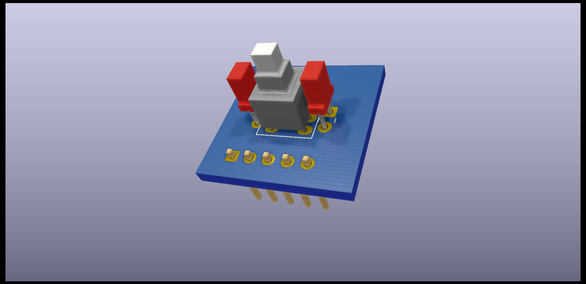

Well, yes you can do that. And that was part of the design for those that really can't \(or don't want to\) use the PCB.  
The PCB gives the whole unit some stability and structure. The base of the 3D printed outer shell sits between the PCB and the components. This gives a base for the switch when it is pressed and pressure is applied. It also holds the components in exact alignment, and most importantly it removes the need for soldering wires inside the unit. This makes it neat and compact, and completley modular.  
Using the pin headers on the PCB means you can easily swap out units and reconnect them without the need for soldering. This makes things easier, but also prevents accidental damage to units with the soldering iron when working in tight spaces.

The LED's have a common **CATHODE**.  
The switches have 2 functions. One is _'Press to make'_ and the other is _'Press to break'_.  
We are using the _'Press to make'_ function, which means that when the switch is closed, it completes the circuit and turns the switch 'On'. The other function does the opposite, and you should check with a multimeter which pins are which on the swtich. I personally break the legs off the switch that we don't need to avoid confusion at a later date. If you don't want to do this, the PCB has holes for these legs. Just double check the orientation of the switch before you solder.

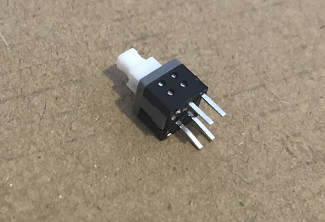

The LED's are placed on either side of the switch, and they are deliberatly square as they are 'directional' and will throw their light in a straight line, helping to avoid light bleed across the unit.  
Each LED then lights up it's respective 'Top' or 'Bottom' display when illuminated.  
There are 5 pins on the board \(see below for the [wiring diagram](pcb.md#wiring-diagram)\), and this enables the switch and each LED to be connected and controlled individually.

It's cheap, well designed, reliable and easy to get your own made. **You can even get the small resistors already soldered to the board at the factory if you don't want to do those yourself.**  
We believe that this is a great way to start with the OpenA3XX project and give yourself some added confidence to take on some of the bigger projects such as the MCDU, for example.

## How To Order Your Own

There are many different PCB manufacturers out there. And some of them require different types of files from each other to make the board. We have created a diverse ZIP folder with many of the files required to give you a good choice of PCB manufacturers.


We can't guarantee compatability across all the available companies, so if you find that you need a file type that is not in the ZIP folder, please let us know and we will aim to generate that file for you ASAP.


We have written this guide and used screenshots from a company called [JLCPCB](https://cart.jlcpcb.com/quote?_ga=2.247745921.762593180.1623936941-1679587472.1623150509). We have used them for our development and were happy with their service and product quality. That being said, we are in no way affiliated with them, and we receive no commision or similar from you using their service. You are free to use any company that you wish, as the process should be very similar.

### 1\) Download Required Files

So, to get started we need to download some files from the OpenA3XX GitHub.  
If you only need the PCB to be made and you will solder on the resistors yourself, then you only need the ZIP folder. If you would like the manufacturer to add on the resistors for you then you will need to BOM and CPL file also.

[OpenA3XX_Korry_PCB.zip](https://github.com/OpenA3XX/opena3xx.3D-CNC_Parts/raw/main/Korry%20Switch/PCB%20Files/OpenA3XX_Korry_PCB.zip)  
[BOM.xlsx](https://github.com/OpenA3XX/opena3xx.3D-CNC_Parts/raw/main/Korry%20Switch/PCB%20Files/BOM.xlsx)  
[CPL.xlsx](https://github.com/OpenA3XX/opena3xx.3D-CNC_Parts/raw/main/Korry%20Switch/PCB%20Files/CPL.xlsx)

### 2\) Upload Files

_The first thing I would recommend doing at this stage is to create a customer account and login before creating the order. It'll make things easier when adding orders to the cart._

When you arrive at your chosen manufacturers site, find their 'Order' page and navigate to it. In our example, we will be greeted with the page below. Click on 'Add gerber file' or it's equivalent on other websites. This will open a file chooser dialog window where you need to select the ZIP folder you downloaded in the previous step.

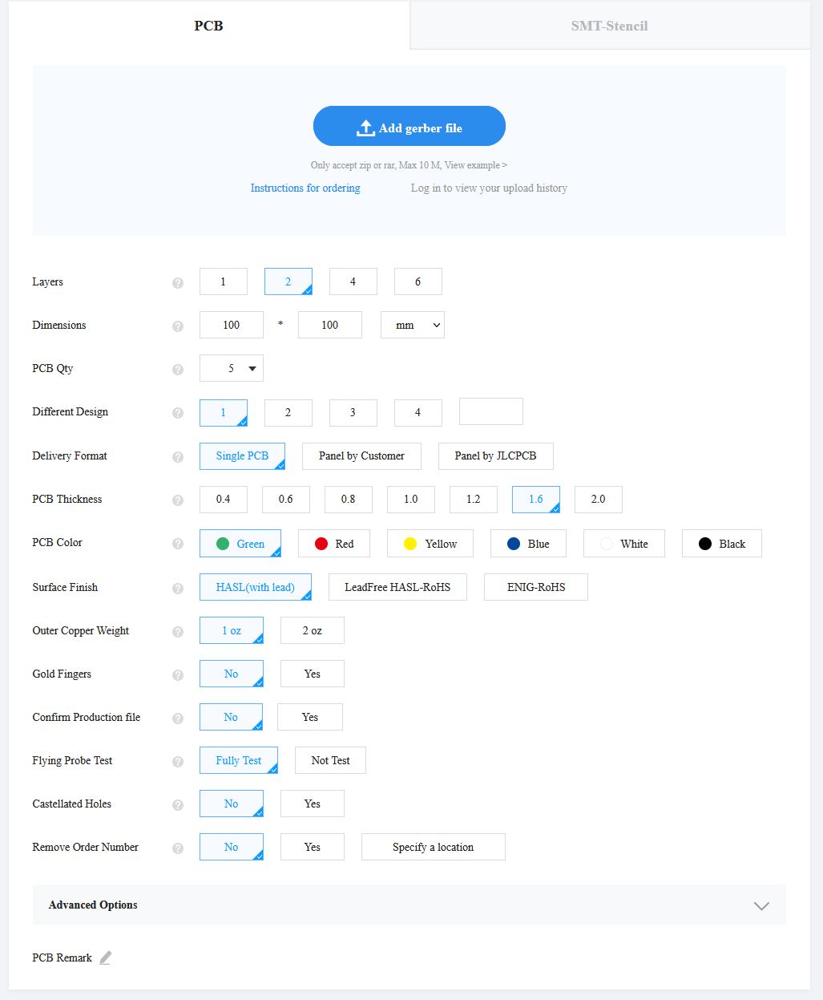

Wait for the files to fully upload, this could take some time depending on your internet connection speed and the website servers of the company you're using.

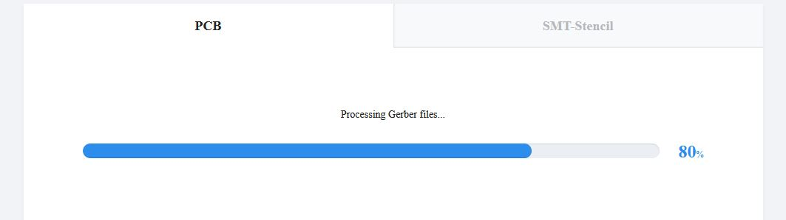

### 3\) Choose Quantity & Design Settings

Once everything is uploaded, you should see a preview of the PCB \(there will be a front and back side as it is 2 sided\). Make sure it looks as it should and that there hasn't been any processing errors or corrupted files. You should see that it has detected a 2 layer board of 20x20mm\(0.79x0.79 inches\).  
Then you need to make some changes to the settings based on your preferences.

1. Firstly, you need to set your quantity. Keep an eye on the updated price on the right hand side as you change the quantities. Sometimes a larger order can be cheaper than a smaller order!
2. Make sure the PCB thickness is set to 1.6mm.
3. Choose a PCB colour. We chose blue because it was our preference, but you should be aware that some colours can't be produced in the same quantities as others. We found that if you want more than 30 with resistors soldered on already for you, that you would need to choose green for example. **Ultimatley, the colour doesn't matter as it won't be seen anyway!**
4. You can change the surface finish to something that doesn't have lead if you wish, but keep an eye on the cost. Using the standard HASL\(with lead\) is significantly cheaper.
5. Optionally you can choose to remove the order number. This has a small additional cost. They will print an order number on the PCB at the factory, but you can have this removed if you wish.
6. You can leave all the other settings as they are, and ignore the advanced settings section. It is not required to change any of these from the default.

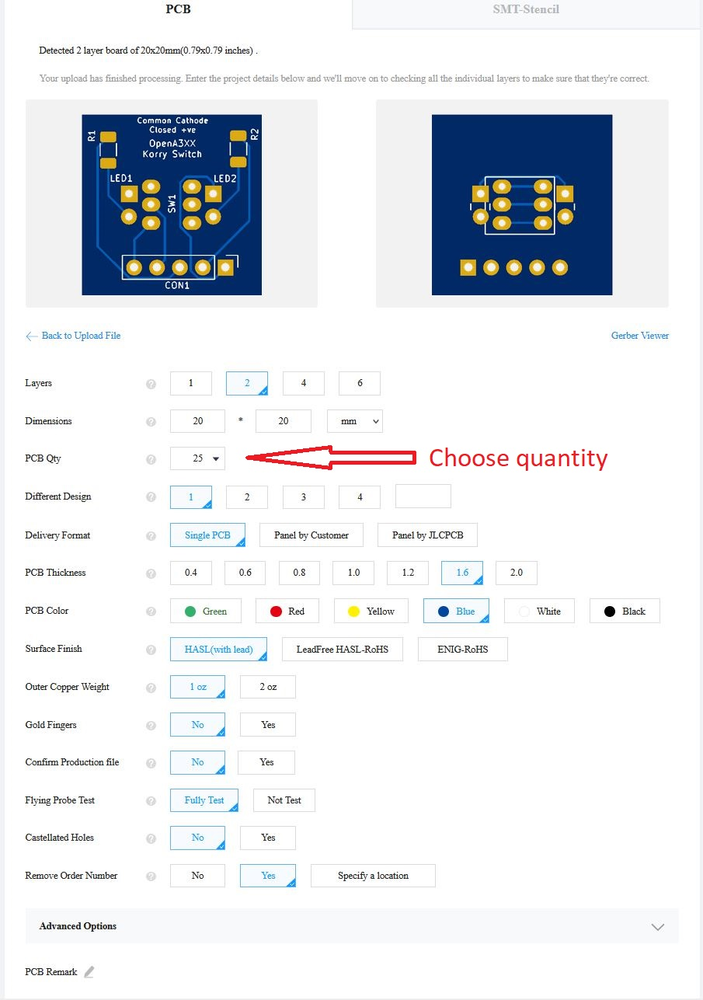

### 4\) Finish - Add To Cart

And that is pretty much it! Just to give you an example of the cost at this stage, for the 25 selected \(with order number removal\) here it comes to £4.52 and standard postage is £3.83. This comes to a very cheap £8.35! _**They do offer faster shipping services if you're willing to pay a bit more.**_

If you don't want the resistors soldered for you then just click _'Save To Cart'_ and you're ready to checkout! If you DO want the resistors, then continue down below to the [optional steps](pcb.md#optional-set-up-pre-soldered-resistors).

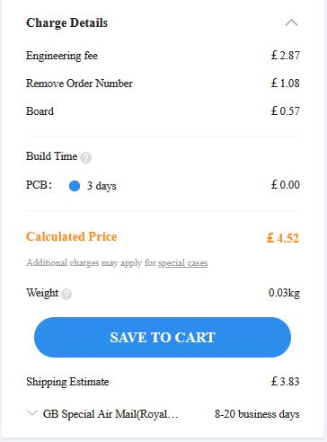


The above figures are correct at the time of writting this document \(June 2021\). Shipping costs may be different based on your location and type of service chosen.


### Optional - Set up Pre-Soldered Resistors

If you would like to have the factory solder the resistors onto the baord for you, then there are a few more steps to go through for this. But, it doesn't take long at all.  
With the PCB setup steps above compelted, scroll down to the next section which is called _'SMT Assembly'_ and click the little switch to select it. You will then see a section that looks like this.  
All you need to do here is make sure that _'Assemble top side'_ is selected and you can leave the tooling holes section on _'Added by JLCPCB'_.  
Click confirm, and this should take you to the next step \(You may need to create an account at this point if you haven't already\).

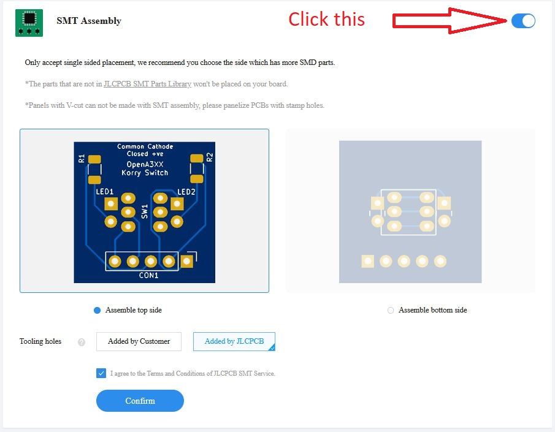

Once you've clicked confirm you will end up on this page where you need to upload 2 more files. The BOM and CPL files we downloaded earlier.  
Upload them using the relevant buttons and when done, click 'Next'.

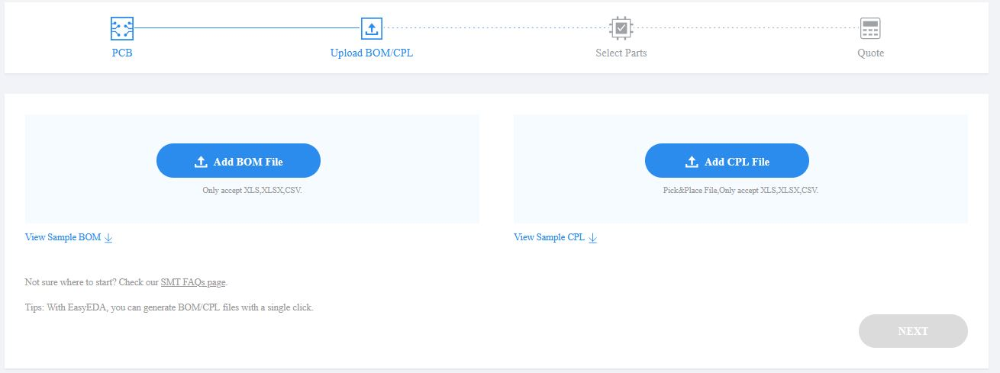

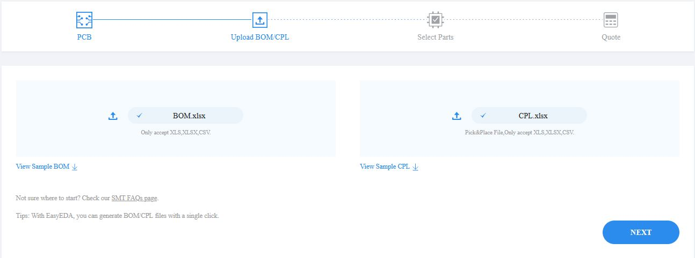

This will bring you to the part selection page. Here the website will try to automatically select parts for you based from the information in the uploaded documents. You will need to make some adjustments here, but again they are very straight forward.  
Firstly, click the magnifying glass on the row for R1. This will open up a search function where you need to type **'C4466'** and click search. This will bring up the part we need for both resistors. Click the select button to choose it. **Then do this again for R2**.

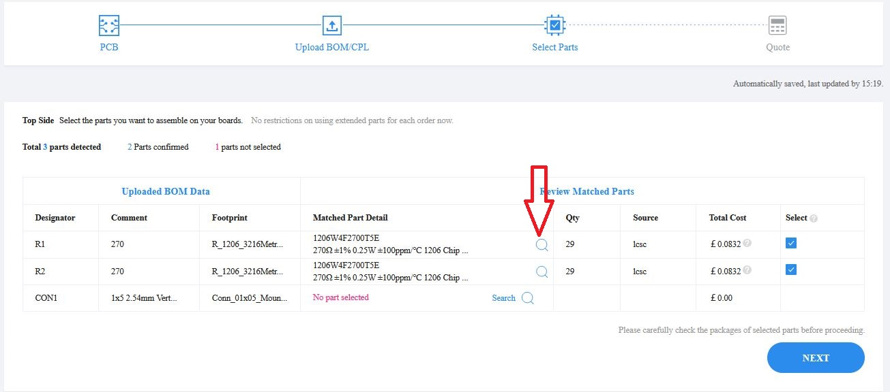

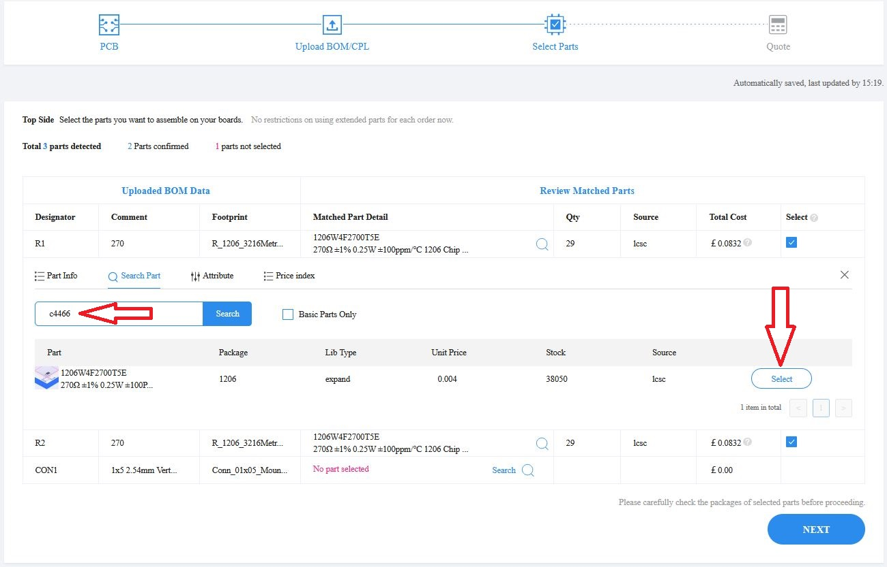

There is an option here to choose the pin headers. I would advise against doing this as it would be best to solder these on later when we can choose the exact clearance we need underneath.  
If you wish to choose this option though, then the part number would be **'C124379'**.

With both resistors selected, uncheck the box for the pin headers \(CON1\), unless of course you have decided to have them installed, and click 'Next'.

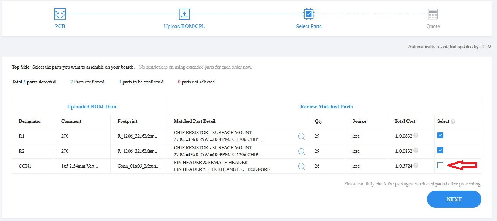

This will take you to the final page where you should confirm everything we have just done.  
You should see just one row of components in the 'Selected Parts' section \(2 rows if you chose the pin headers too\), and you should see that it has allocated this part to both R1 and R2.  
\(_If you chose the pin header, that should be allocated to CON1\)_

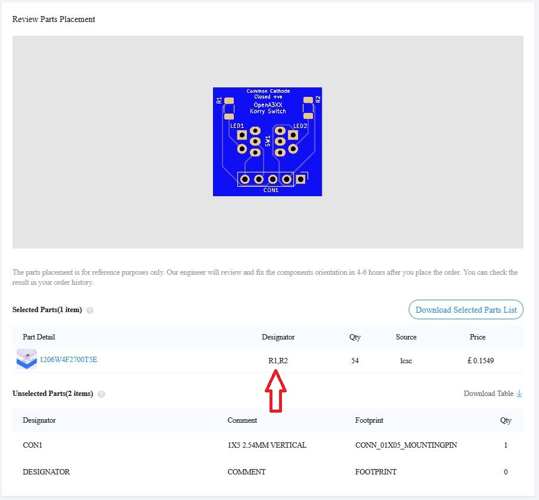

And that's it! All done! Just add this to your cart and complete the checkout process.  
Make sure you choose the appropriate shipping option for you.  
Here you can see the cost breakdown \(correct at the time of writting this document, June 2021\) of the PCB board itself and the cost of having the resistors soldered for you on **ALL 25** boards.

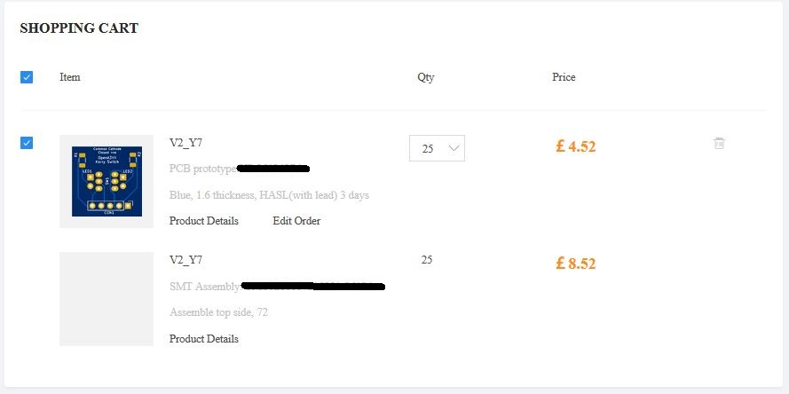

This is meant to be used as a guide, and depending on the choices and quantities you select, your order will come out at a different cost.  
Other manufacturers may be cheaper or more expensive. We have used this company to demonstrate the ordering process.  
If you have any questions about this, please don't hesitate to contact us.  
The best way will be in the [Discord](https://discord.gg/55aufspsDs).

## Wiring Diagram

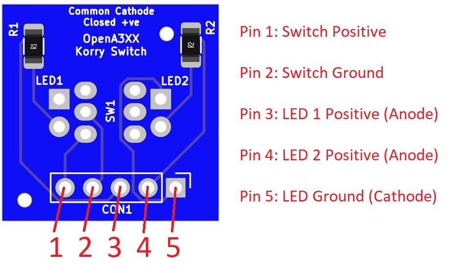

## Photos & Renders

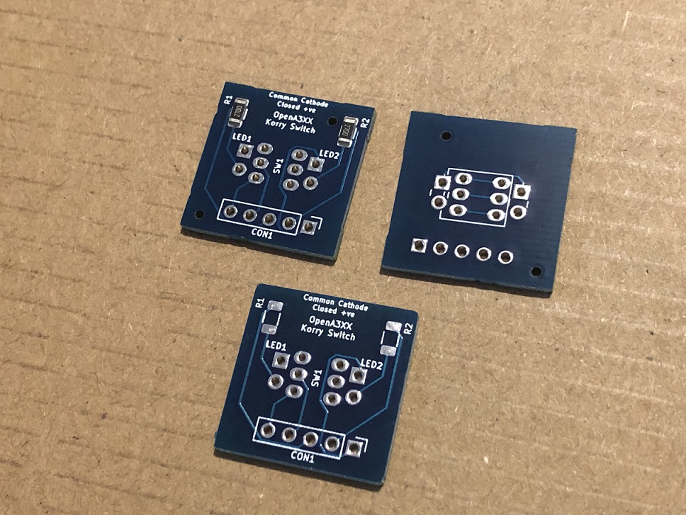

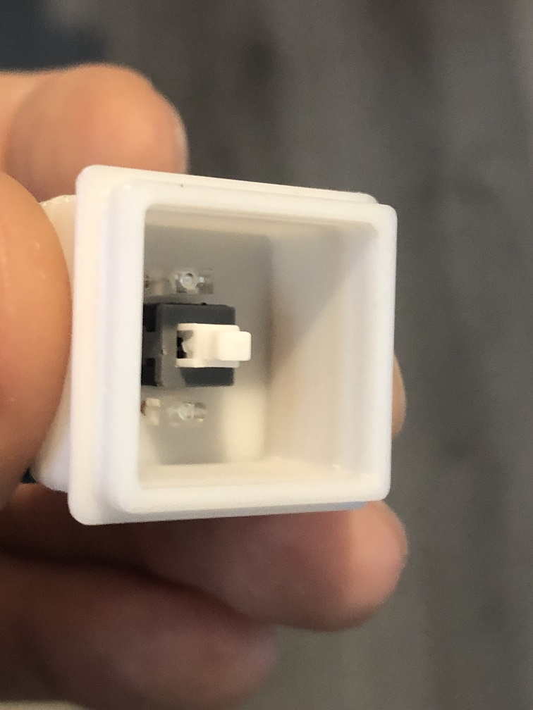

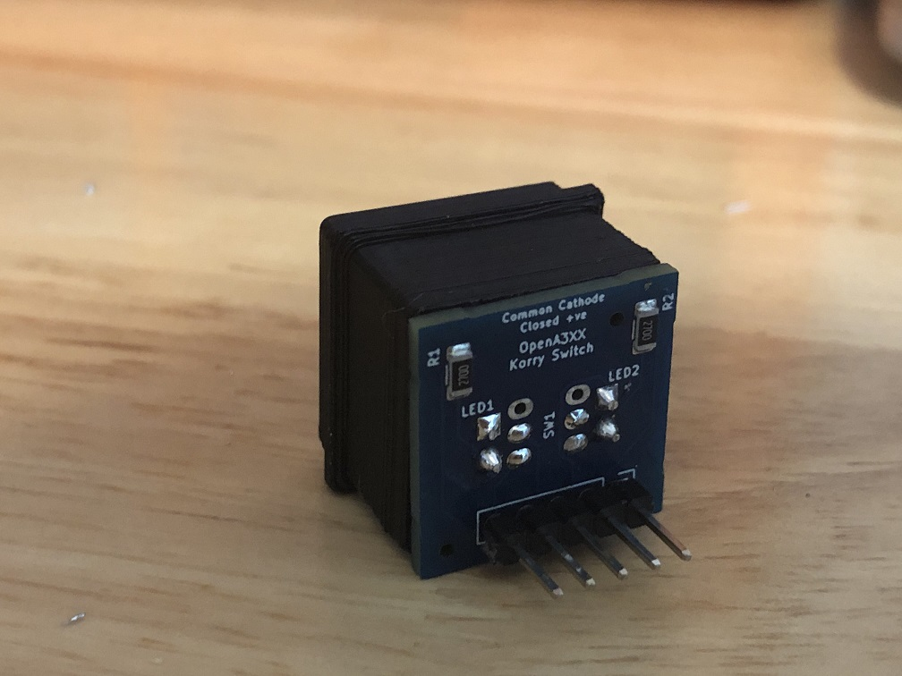

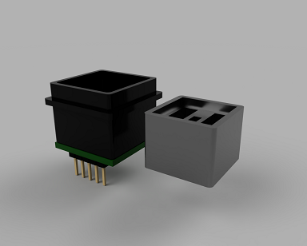

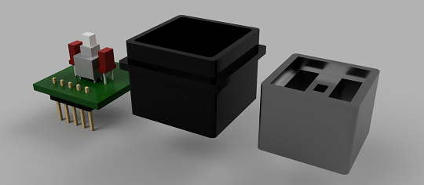
