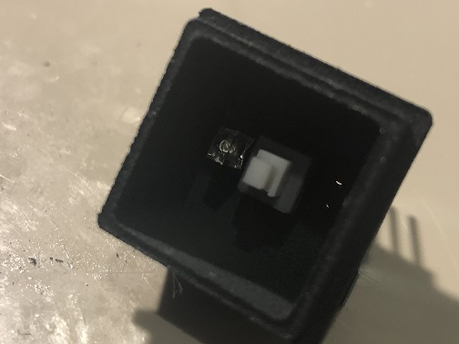

# Putting It Together

## What You Need

So you've gone through all the previous steps, and now it's time to put it all together!  
First thing to do is to check we have everything we need.

* Inner & outer shells
* 2x square LED's _\(in appropriate colours for the label type\)_
* 1x 5.8mm tactile switch _\(Locking or non-locking depending on the label type\)_
* 1x Acrylic inlay
* 1x PCB 
* 2x 270 ohm SMD resistors \(1206 footprint\) - **ONLY IF PCB NOT PRE-SOLDERED**
* 1x pin header \(5x1\)

And of course you'll also need a soldering iron heate to 350 degrees, some flux core solder, tweezers, helping hands, multimeter, solder wick and a good beverage of choice!

## Let's Get Started

The first thing to do is to solder the 2 resistors onto the PCB if you don't have the pre-soldered boards.  
This is a simple case of putting a small amount of solder onto one of the pads, then placing the resistor ontop while re-heating the solder and letting it sit in place. Then add the solder onto the other side.  
You can find plenty of videos on YouTube on how to solder SMD components should you need some more information on this.  
  
The next thing to do is to solder the pin headers onto the board. We want to make sure that the pin headers don't stick out too much on the other side because we need the board to sit as flush against the bottom of the shell as possible. So, place the PCB on a flat surface, put the pin headers in and slide the black grips down flush with the board.

Now it's a case of soldering them in place. You can see from the picture below that only a small amount of solder is needed here, and with the help of some helping hands it's a simple job to do. Just get one of the legs soldered in place first and that will then hold it in place so you can solder the rest.

Congratulations! I found these were the most fiddly parts to do. From here it should be pretty easy!  
The next thing to do is to take your tactile switch and find out which way round the switch needs to go. We want the switch to work so that when it is closed, we have a postive signal. So, take your multimeter and work out which legs of the switch can be removed. This is done by simply using the continuity setting. Once you've worked it out, you should notice one side of the switch has a marking of some kind to make it easier when doing this for the other ones.  
I then remove the legs from the switch we don't need to avoid confusion.

Now, with a pair of tweezers, take the switch and place it into the outer shell and through the holes in the middle, then take the PCB and locate the legs from the switch into it. You will notice the legs of the switch are flush with the PCB, so whilst holding the switch and PCB together, solder one of the legs, and this will then hold it all together so you can solder the remaining 3 legs.

Great job! It's looking great so far! Now, you can test your soldering skills and make sure the switch is working with the multimeter. Put the probes of the meter on the relevant pins and press the switch on and off to make sure everything is working as it should.  
It's best to check this now, rather than getting to the end and having to working around the LED's!  
  
Ok, everything is working fine and now it's time to add the LED's!  
You can technically put the LED in either side, because you can always roate the inner shell 180 degrees to get them the right way round. But, as a rule of thumb we've worked it out as LED1 is the top and LED 2 is the bottom. Sometimes it's just easier to set a pattern and stick to it to avoid confusion.  
  
The long leg of the LED is the positive leg. The square terminal on the PCB is the negative terminal, so make sure the shorter leg of the LED goes through the square terminal.  
Place the LED through the hole, and it can sit about level with the switch, as seen below.

Solder the LED in place, again making sure you have the LED the right way round. Once you're happy with this then do this again for the second LED, and you're almost finished!

At this point I would reccomend checking your soldering skills and the connections again. Use your multimeter to check the LED's. You can use the diode function of your multimeter, and this will cause the LED to light up very dim. Do this by putting the probes onto the relevant pins on the pin header.


You can also download our Arduino test sketch. You can plug the entire Korry switch into a breadboard and the arduino will test your LED's and the switch.

Full details on how it works and is set up is in the directory on the GitHub page.


Once you're happy with all the connections, you can trim the legs of the LED's off, and then assemble the inner shell.  
This is just a case of making sure the inlay is round the right way, so that the top and bottom are aligned with the cutouts, and not across them. Simply push the acrylic inlay in and it should sit perfectly and be held in by friction. If they are a bit loose, a small drop of super glue will hold them perfectly.

And congratulations! You have succesfully built your very own OpenA3XX Korry switch!  
The first one will take some time, and you will probably make a mistake or two, but as you do more of them, you will start making them pretty quickly!  
  
Let us know how you get on, and we'd love to see some pictures of your work!

